**Keywords**: rebase, git rebase, history replay, rebase conflict, continue rebase, abort rebase, git worktree, rewritten history, authorized force-with-lease publication

## Result-bound verification

For start/continue completion, bind validation to the immutable result commit `R`.
Run repository-required and changed-interaction checks on a clean detached worktree
or equivalent isolated checkout of `R`, separately from restored user changes.
Preserve unrelated work; a passing dirty worktree does not validate its commit.
Record the checked OID and environment; verify checks left tracked source unchanged.
Source-mutating checks invalidate that evidence. Commit a required correction within
the existing task authority, then rebind `R` and rerun its checks. When that commit
is blocked or unauthorized, pause rather than reporting the correction published.
Every result change, including remote reconciliation, invalidates earlier result
validation. Reobserve the named result ref before completion; it must still name
`R`. A decision or stopped-state path cannot become a success merely because its
refs or ancestry still satisfy the goal.

## Publication authority

A start request to rebase a branch authorizes publishing `R` to that branch's own remote
destination, using `--force-with-lease` bound to an observed destination OID. Local-only
wording in the request withdraws it. Continue publishes only under authority bound at
start; abort never publishes. Any other destination, any lease not bound to an
observed OID, and any other force-push needs explicit authority.

Other parties update remote feature branches. Fetch the destination before replay and
again before pushing; integrate what it gained, then continue
([publication](./references/publication.md)).

## Workflow

```mermaid
flowchart TD
    Start([Agent receives explicit start, continue, or abort request]) --> Kind{Request?}
    Kind -->|Start| Bind[Agent: from request/task context bind exact refs/OIDs, requested observable history/ref relation, destinations, authority, worker facts]; Kind -->|Continue or abort| Active["`Agent: read [active recovery](./references/active-rebase-recovery.md); bind metadata-owning worktree/Git dir`"]
    Bind --> BindResult{All dependent facts observed or explicitly bound?}
    BindResult -->|Yes| Satisfied{No active rebase; S/T unchanged; ancestry-only; T ancestor of S?}; BindResult -->|Missing or ambiguous| Decision; BindResult -->|Failure or unobservable| Recover
    Satisfied -->|Yes; destinations equal required result; read-only| NoChange[Agent: record no-change evidence]; Satisfied -->|No or transformation goal| Locate
    Satisfied -->|Yes; only publication differs| Locate; Satisfied -->|Failure or unobservable| Recover
    Active --> ActiveResult{Inspection result?}; ActiveResult -->|No metadata in bound worktree and Git dir| NoActive[Agent: record absent metadata and no mutation]; ActiveResult -->|Owner and required contract rebound| Safe
    ActiveResult -->|Required contract fact missing or inconsistent| Decision; ActiveResult -->|Failure or unobservable| Recover
    Locate[Agent: find exact source attachment; record worktree/Git-dir ownership] --> Location{Bound source location?}
    Location -->|Source branch attached here| Safe; Location -->|Source branch unattached| BranchWT[Agent: create start-only branch worktree]
    Location -->|Source attached elsewhere| BindWT[Agent: bind that exact worktree/Git dir]; Location -->|Non-branch OID; result bound| DetachedWT[Agent: create start-only detached worktree]
    Location -->|Failure or unobservable| Recover; BindWT --> Safe
    BranchWT --> WTResult{Creation result?}; DetachedWT --> WTResult
    WTResult -->|HEAD OID equals source; branch attachment matches when required| Safe; WTResult -->|Failure or unobservable| Recover
    Safe[Agent: observe worktree writers; request pause when supported] --> Owner{Worker checkpoint observation?}
    Owner -->|No writer, acknowledged pause, or worker ended| Operation{Operation?}; Owner -->|Writer active| Wait[Agent: wait once for pause, end, or command result]
    Owner -->|Unknown or unreachable| Decision
    Wait --> WaitResult{Observed wait outcome?}; WaitResult -->|Checkpoint met or worker ended/failed without writer| Operation; WaitResult -->|Still running and cannot pause/end| Decision
    WaitResult -->|Failure or unobservable| Recover
    Operation -->|Start| Prepare[Agent: observe status; checkpoint only task-authorized changes after worker checkpoint]; Operation -->|Continue or abort| ActiveGuard[Agent: reobserve same owner metadata and saved-entry identity]
    ActiveGuard --> ActiveGuardResult{Owning worktree/Git-dir metadata unchanged?}
    ActiveGuardResult -->|Continue| Stop{Current active-rebase state?}; ActiveGuardResult -->|Abort| Abort["`Agent: read [active recovery](./references/active-rebase-recovery.md); abort in bound owner and restore pre-state`"]
    ActiveGuardResult -->|No, failure, or unobservable| Recover
    Prepare --> PrepResult{Status empty after checkpoint containing every observed change?}
    PrepResult -->|Yes| Refs; PrepResult -->|No; checkpoint commit blocked| Save["`Agent: read [named stash](./references/named-stash.md); save and bind exact entry`"]
    PrepResult -->|Failure or unobservable| Recover
    Save --> SaveResult{Exact entry verified?}; SaveResult -->|Yes| Refs; SaveResult -->|No or unobservable| Recover
    Refs["`Agent: reobserve exact source and target; when a publication destination is bound, fetch it per [publication](./references/publication.md) remote sync`"] --> RefResult{Ref result?}
    RefResult -->|Bound OIDs unchanged| Next; RefResult -->|Same named refs or bound destination moved| Account[Agent: account for movement; integrate compatible destination commits into the source before replay]
    RefResult -->|Failure or unobservable| Recover
    Account --> AccountResult{Every moved commit has one evidence-backed disposition?}
    AccountResult -->|All classified; no supported conflict| Next; AccountResult -->|Unclassified or conflicting| Decision
    AccountResult -->|Failure or unobservable| Recover
    Next{Reobserved start path?} -->|Replay required| Shape; Next -->|No-replay publication; bound goal relation true| Current[Agent: bind current result OID R]
    Next -->|Failure or unobservable| Recover
    Current --> CurrentResult{Named result ref resolves to R?}; CurrentResult -->|Yes| Saved; CurrentResult -->|No or unobservable| Recover
    Shape{Merge in fresh replay set?} -->|Yes| History["`Agent: read [history shape](./references/history-shape.md); choose state-specific disposition`"]
    Shape -->|No| StartReplay[Agent: start fresh replay in bound start worktree]; Shape -->|Failure or unobservable| Recover
    History --> HistoryResult{Supported state-specific disposition?}
    HistoryResult -->|Fresh start topology chosen| StartReplay; HistoryResult -->|Active commit: skip| Skip[Agent: skip only the classified active commit]
    HistoryResult -->|Active commit: preserve| Preserve[Agent: preserve classified active commit, then continue]; HistoryResult -->|No or conflicting| Decision
    HistoryResult -->|Failure or unobservable| Recover
    Stop -->|Unmerged entries| ReplayConflict; Stop -->|Topology, equivalent, or empty| History
    Stop -->|Metadata active; resolution staged or no conflict| ContinueReplay[Agent: continue the bound active replay]
    Stop -->|Other failure or unobservable| Recover
    StartReplay --> ReplayResult{Replay operation result?}; ContinueReplay --> ReplayResult; Skip --> ReplayResult; Preserve --> ReplayResult
    ReplayResult -->|Metadata/unmerged absent; R bound; result ref and bound goal relation match| Saved{Lifecycle saved entry?}
    ReplayResult -->|Unmerged entries| ReplayConflict["`Agent: read [conflict and ambiguity](./references/conflict-and-ambiguity.md); resolve replay intent`"]
    ReplayResult -->|Topology, equivalent, or empty| History; ReplayResult -->|Other failure or unobservable| Recover
    ReplayConflict --> ReplayIntent{Exactly one outcome preserves compatible intent, passes checks, and is staged?}
    ReplayIntent -->|Yes; active metadata unchanged| ContinueReplay; ReplayIntent -->|None or incompatible alternatives| Decision
    ReplayIntent -->|Failure or unobservable| Recover
    Abort --> AbortResult{Abort restoration predicate?}
    AbortResult -->|Metadata/unmerged absent; source or HEAD equals pre-replay OID| Saved; AbortResult -->|Failure or unobservable| Recover
    Saved -->|Verified none| FinishMode{Lifecycle outcome?}; Saved -->|Exact entry bound| Restore["`Agent: read [named stash](./references/named-stash.md); apply exact OID and preserve entry`"]
    Saved -->|Ambiguous or unobservable| Recover
    Restore --> RestoreResult{Apply result?}
    RestoreResult -->|Conflict-free| RestoreFinish[Agent: verify tree/checks; relist unique entry; drop selector; confirm absent]
    RestoreResult -->|Conflict; entry preserved| RestoreConflict["`Agent: read [conflict and ambiguity](./references/conflict-and-ambiguity.md); resolve restoration intent`"]
    RestoreResult -->|Other failure or unobservable| Recover
    RestoreConflict --> RestoreIntent{Exactly one outcome preserves compatible intent and passes checks?}
    RestoreIntent -->|Yes| RestoreFinish; RestoreIntent -->|None or incompatible alternatives| Decision
    RestoreIntent -->|Failure or unobservable| Recover
    RestoreFinish --> RestoreFinishResult{Checks zero, no unmerged entries, exact entry absent?}; RestoreFinishResult -->|Yes| FinishMode; RestoreFinishResult -->|No or unobservable| Recover
    FinishMode -->|Explicit abort| OrientAbort[Agent: inventory interactions; verify restored assumptions]
    FinishMode -->|Start or continue| Orient[Agent: bind committed result R; run repository and changed-interaction checks on its isolated tree]
    Orient --> VerifyResult{Checks pass on unchanged tracked tree of R; result ref equals R; no unmerged entries; intersections recorded?}
    VerifyResult -->|Yes| Publish{Publication bound and authorized?}
    VerifyResult -->|Failure attributable to replay; one correction within bound goal| Correct[Agent: apply and commit only the task-authorized replay correction]; VerifyResult -->|Not attributable, outside goal, missing intent, or alternatives| Decision
    VerifyResult -->|Failure or unobservable| Recover
    Correct --> CorrectResult{Correction committed within task authority?}
    CorrectResult -->|Yes; invalidate old evidence and rebind R| Orient; CorrectResult -->|Commit blocked or unauthorized| Decision; CorrectResult -->|Failure or unobservable| Recover
    Publish -->|No| Handoff; Publish -->|Yes| Remote["`Agent: read [publication](./references/publication.md); reconcile destination movement for this attempt`"]
    Remote --> RemoteResult{Remote stage result?}
    RemoteResult -->|Final fetch unchanged; exact lease current; R revalidated; result ref equals R| Push[Agent: push immutable R with the authorized exact lease]
    RemoteResult -->|Destination moved at final observation| Retry
    RemoteResult -->|Unexpected result-ref change| Decision
    RemoteResult -->|Conflict| RemoteConflict["`Agent: read [conflict and ambiguity](./references/conflict-and-ambiguity.md); resolve remote intent`"]
    RemoteResult -->|Failure or unobservable| Recover
    RemoteConflict --> RemoteIntent{Exactly one outcome preserves compatible intent and passes checks?}
    RemoteIntent -->|Exactly one| Retry; RemoteIntent -->|None or incompatible alternatives| Decision
    RemoteIntent -->|Failure or unobservable| Recover
    Push --> PushResult{Push result?}
    PushResult -->|Exit zero; post-fetch destination equals R| Handoff; PushResult -->|Lease rejected or destination moved| Retry{Attempts used below the cap in publication.md?}
    Retry -->|Yes| Remote; Retry -->|No| LeaseStop[Agent: stop external mutation; report each attempt, its rejection or movement, and the destination]
    PushResult -->|Other failure or unobservable| Recover
    NoChange --> Handoff; NoActive --> Handoff; Decision[Agent: stop mutation; report missing fact/alternatives and evidence] --> Handoff
    Recover["`Agent: read [active recovery](./references/active-rebase-recovery.md); stop mutation and collect report`"] --> Handoff
    OrientAbort --> Handoff; LeaseStop --> Handoff
    Handoff[Agent: carry the reached lifecycle path; check acquired worker obligation] --> Worker{Worker obligation?}
    Worker -->|None| Terminal{Reached lifecycle path and current evidence?}; Worker -->|Acquired| Deliver[Agent: deliver summary and resume/stop decision]
    Worker -->|Unknown or unobservable| Pending([Agent: stop mutation; preserve repo; report last worker state, handoff attempt, missing ack/observation; no completion])
    Deliver --> HandoffResult{Acknowledged summary/resume, or worker observed stopped with handoff?}
    HandoffResult -->|Yes| Terminal; HandoffResult -->|No or unobservable| Pending
    Terminal -->|Abort request and restored pre-state| Aborted([Aborted and restored])
    Terminal -->|Successful start/continue path; validation current for R; result ref and post-push destination equal R| Published([Published completion])
    Terminal -->|Successful start/continue path; validation current for R; result ref equals R; goal relation true; no publication| Local([Local completion])
    Terminal -->|No-change evidence complete| NoChangeDone([No change]); Terminal -->|Metadata absent; no mutation| NoActiveDone([No active rebase])
    Terminal -->|Decision report complete| Paused([Paused for decision]); Terminal -->|Stopped-state report complete| Stopped([Stopped with observed state])
    Terminal -->|Inconsistent or unobservable| Recover
```

