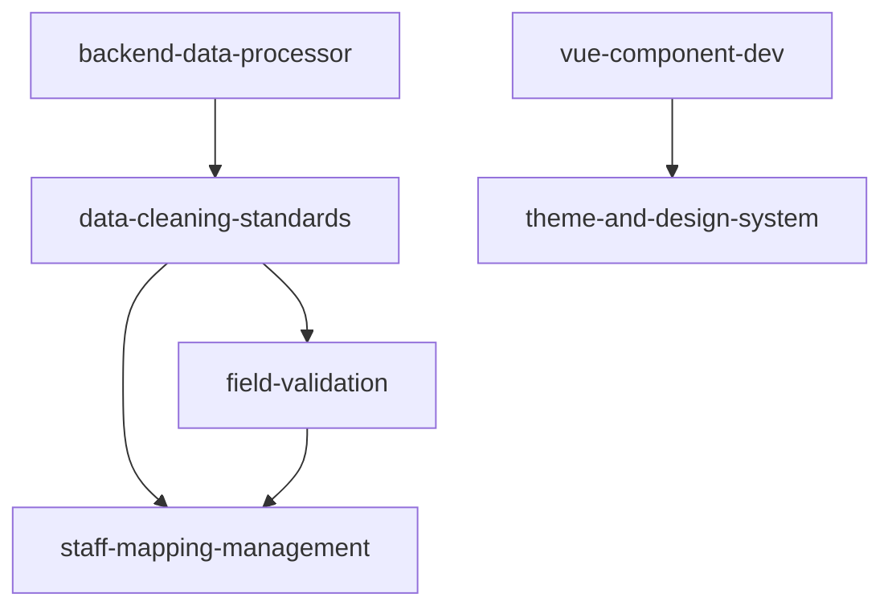

# Skill Refactor: Meta-Skill for Skill System Evolution

A self-analyzing skill that audits, evaluates, and refactors the entire skill ecosystem.

## When to Activate

Use this skill when:
- "Analyze our skills" or "audit skill system"
- "Find redundant content across skills"
- "Score skill atomicity" or "are skills atomic enough?"
- "Map skill dependencies" or "composability graph"
- "Refactor skill architecture"
- Planning skill system evolution

## Philosophy

**Radical Atomicity**: Each skill should do ONE thing exceptionally well.

**Composability**: Skills are Lego blocks - AI orchestrates them dynamically.

**State-Awareness**: Skills read live project state, not static snapshots.

---

## Quick Start Workflow

```
Step 1: Discover & Parse Skills
  ↓
Step 2: Run 5 Analysis Layers
  ↓
Step 3: Generate Refactoring Report
  ↓
Step 4: Propose Concrete Actions
```

---

## Step 1: Discover & Parse Skills

### 1.1 Find All Skills

```python
import os
import re
from pathlib import Path

def discover_skills(skills_dir='.claude/skills'):
    """Find all SKILL.md files"""

    skills = []
    for root, dirs, files in os.walk(skills_dir):
        for file in files:
            if file.upper() in ['SKILL.MD', 'skill.md']:
                skill_path = Path(root) / file
                skills.append({
                    'path': str(skill_path),
                    'name': Path(root).name,
                    'dir': root
                })

    return skills
```

### 1.2 Parse Skill Metadata

```python
def parse_skill(skill_path):
    """Extract metadata and content from SKILL.md"""

    with open(skill_path, 'r', encoding='utf-8') as f:
        content = f.read()

    # Parse YAML frontmatter
    frontmatter = {}
    yaml_match = re.match(r'^---\n(.*?)\n---', content, re.DOTALL)
    if yaml_match:
        yaml_content = yaml_match.group(1)
        for line in yaml_content.split('\n'):
            if ':' in line:
                key, value = line.split(':', 1)
                frontmatter[key.strip()] = value.strip()

    # Extract structure
    sections = re.findall(r'^#{1,3}\s+(.+)$', content, re.MULTILINE)
    code_blocks = re.findall(r'```\w*\n(.*?)```', content, re.DOTALL)

    # Count metrics
    lines = content.split('\n')

    return {
        'frontmatter': frontmatter,
        'sections': sections,
        'code_blocks': code_blocks,
        'line_count': len(lines),
        'word_count': len(content.split()),
        'content': content
    }
```

---

## Step 2: Run 5 Analysis Layers

### Layer 1: Atomicity Scoring (0-100)

**Definition**: How well does the skill follow Single Responsibility Principle?

```python
def score_atomicity(skill_data):
    """Score how atomic this skill is (0-100)"""

    score = 100
    penalties = []

    # Penalty 1: Too many top-level sections (>5)
    top_sections = [s for s in skill_data['sections'] if not s.startswith(' ')]
    if len(top_sections) > 5:
        penalty = min(20, (len(top_sections) - 5) * 3)
        score -= penalty
        penalties.append(f"Too many sections ({len(top_sections)}): -{penalty}")

    # Penalty 2: File too long (>500 lines)
    if skill_data['line_count'] > 500:
        penalty = min(30, (skill_data['line_count'] - 500) // 50 * 5)
        score -= penalty
        penalties.append(f"File too long ({skill_data['line_count']} lines): -{penalty}")

    # Penalty 3: Multiple unrelated topics (keyword diversity)
    content_lower = skill_data['content'].lower()
    topic_keywords = {
        'frontend': ['vue', 'component', 'ui', 'css'],
        'backend': ['api', 'endpoint', 'flask', 'pandas'],
        'data': ['clean', 'validate', 'transform', 'csv'],
        'deployment': ['deploy', 'nginx', 'docker', 'server'],
        'testing': ['test', 'debug', 'error', 'validate']
    }

    matched_topics = []
    for topic, keywords in topic_keywords.items():
        if any(kw in content_lower for kw in keywords):
            matched_topics.append(topic)

    if len(matched_topics) > 2:
        penalty = (len(matched_topics) - 2) * 10
        score -= penalty
        penalties.append(f"Multiple topics ({', '.join(matched_topics)}): -{penalty}")

    # Penalty 4: Too many code examples (>15)
    if len(skill_data['code_blocks']) > 15:
        penalty = min(20, (len(skill_data['code_blocks']) - 15) * 2)
        score -= penalty
        penalties.append(f"Too many code blocks ({len(skill_data['code_blocks'])}): -{penalty}")

    return {
        'score': max(0, score),
        'penalties': penalties,
        'recommendations': generate_atomicity_recommendations(score, penalties)
    }

def generate_atomicity_recommendations(score, penalties):
    """Generate actionable recommendations"""
    recs = []

    if score < 70:
        recs.append("⚠️ Consider splitting into multiple atomic skills")
    if any('too long' in p.lower() for p in penalties):
        recs.append("📄 Move detailed examples to separate reference docs")
    if any('multiple topics' in p.lower() for p in penalties):
        recs.append("🔀 Split by topic domain (e.g., frontend vs backend)")

    return recs
```

### Layer 2: Redundancy Detection

**Find duplicate content across skills**

```python
def detect_redundancy(all_skills_data):
    """Find overlapping content between skills"""

    redundancies = []

    # Check code block similarity
    for i, skill1 in enumerate(all_skills_data):
        for skill2 in all_skills_data[i+1:]:

            # Compare code blocks
            common_code = []
            for code1 in skill1['code_blocks']:
                for code2 in skill2['code_blocks']:
                    similarity = calculate_similarity(code1, code2)
                    if similarity > 0.8:  # 80% similar
                        common_code.append({
                            'code': code1[:100] + '...',
                            'similarity': similarity
                        })

            if common_code:
                redundancies.append({
                    'skill1': skill1['frontmatter'].get('name', 'Unknown'),
                    'skill2': skill2['frontmatter'].get('name', 'Unknown'),
                    'type': 'code_duplication',
                    'instances': len(common_code),
                    'samples': common_code[:3]
                })

    # Check section title overlap
    for i, skill1 in enumerate(all_skills_data):
        for skill2 in all_skills_data[i+1:]:
            common_sections = set(skill1['sections']) & set(skill2['sections'])
            if len(common_sections) > 2:
                redundancies.append({
                    'skill1': skill1['frontmatter'].get('name', 'Unknown'),
                    'skill2': skill2['frontmatter'].get('name', 'Unknown'),
                    'type': 'section_overlap',
                    'common_sections': list(common_sections)
                })

    return redundancies

def calculate_similarity(text1, text2):
    """Simple Jaccard similarity for code blocks"""
    words1 = set(text1.lower().split())
    words2 = set(text2.lower().split())

    intersection = words1 & words2
    union = words1 | words2

    return len(intersection) / len(union) if union else 0
```

### Layer 3: Composability Mapping

**Build dependency graph showing skill relationships**

```python
def build_composability_graph(all_skills_data):
    """Map which skills reference which (create dependency graph)"""

    graph = {}

    for skill in all_skills_data:
        skill_name = skill['frontmatter'].get('name', 'Unknown')
        references = []

        # Find "Related Skills" section
        content = skill['content']
        related_match = re.search(
            r'Related Skills?:(.+?)(?=\n#|\Z)',
            content,
            re.DOTALL | re.IGNORECASE
        )

        if related_match:
            related_text = related_match.group(1)
            # Extract skill names (pattern: `skill-name`)
            ref_names = re.findall(r'`([a-z-]+)`', related_text)
            references = ref_names

        graph[skill_name] = {
            'references': references,
            'referenced_by': []  # Will populate in second pass
        }

    # Second pass: populate referenced_by
    for skill_name, data in graph.items():
        for ref in data['references']:
            if ref in graph:
                graph[ref]['referenced_by'].append(skill_name)

    return graph

def analyze_composability(graph):
    """Analyze graph for composability patterns"""

    insights = {
        'orphan_skills': [],  # No references in or out
        'hub_skills': [],     # Referenced by many
        'leaf_skills': [],    # Reference others but not referenced
        'circular_refs': []   # Circular dependencies
    }

    for skill_name, data in graph.items():
        total_connections = len(data['references']) + len(data['referenced_by'])

        if total_connections == 0:
            insights['orphan_skills'].append(skill_name)
        elif len(data['referenced_by']) >= 3:
            insights['hub_skills'].append({
                'skill': skill_name,
                'referenced_by_count': len(data['referenced_by'])
            })
        elif len(data['references']) > 0 and len(data['referenced_by']) == 0:
            insights['leaf_skills'].append(skill_name)

        # Check for circular references
        for ref in data['references']:
            if ref in graph and skill_name in graph[ref]['references']:
                insights['circular_refs'].append(f"{skill_name} ↔ {ref}")

    return insights
```

### Layer 4: State-Awareness Assessment

**Identify static vs dynamic content**

```python
def assess_state_awareness(skill_data):
    """Check if skill uses static data vs live project state"""

    content = skill_data['content']

    # Indicators of static content (bad)
    static_patterns = [
        (r'\(\d+ records as of \d{4}-\d{2}-\d{2}\)', 'hardcoded_record_count'),
        (r'Total: \d+ files', 'hardcoded_file_count'),
        (r'Version: v\d+\.\d+', 'hardcoded_version'),
        (r'Last updated: \d{4}-\d{2}-\d{2}', 'hardcoded_date')
    ]

    static_instances = []
    for pattern, label in static_patterns:
        matches = re.findall(pattern, content)
        if matches:
            static_instances.append({
                'type': label,
                'count': len(matches),
                'samples': matches[:3]
            })

    # Indicators of dynamic content (good)
    dynamic_patterns = [
        (r'json\.load\(', 'reads_json_config'),
        (r'pd\.read_csv\(', 'reads_csv_data'),
        (r'os\.listdir\(', 'checks_file_system'),
        (r'git log', 'queries_git_history')
    ]

    dynamic_instances = []
    for pattern, label in dynamic_patterns:
        if re.search(pattern, content):
            dynamic_instances.append(label)

    # Calculate state-awareness score
    static_count = len(static_instances)
    dynamic_count = len(dynamic_instances)

    if static_count + dynamic_count == 0:
        score = 50  # Neutral
    else:
        score = int((dynamic_count / (static_count + dynamic_count)) * 100)

    return {
        'score': score,
        'static_instances': static_instances,
        'dynamic_capabilities': dynamic_instances,
        'recommendation': 'Replace hardcoded values with live queries' if score < 50 else 'Good state-awareness'
    }
```

### Layer 5: Coverage Gap Analysis

**Identify missing skills based on project files**

```python
def detect_coverage_gaps(project_root='.'):
    """Find project areas without dedicated skills"""

    # Scan project structure
    tech_stack = {
        'frontend': [],
        'backend': [],
        'data': [],
        'config': [],
        'docs': []
    }

    for root, dirs, files in os.walk(project_root):
        # Skip node_modules, venv, etc.
        dirs[:] = [d for d in dirs if d not in ['.git', 'node_modules', '.venv', '__pycache__']]

        for file in files:
            ext = Path(file).suffix

            if ext == '.vue':
                tech_stack['frontend'].append(file)
            elif ext == '.py':
                tech_stack['backend'].append(file)
            elif ext == '.csv':
                tech_stack['data'].append(file)
            elif ext in ['.json', '.yaml', '.yml', '.toml']:
                tech_stack['config'].append(file)
            elif ext == '.md':
                tech_stack['docs'].append(file)

    # Check which areas lack skills
    gaps = []
    if len(tech_stack['config']) > 5:
        gaps.append({
            'area': 'Configuration Management',
            'reason': f"{len(tech_stack['config'])} config files but no config skill",
            'suggested_skill': 'config-management'
        })

    # Check for testing files
    test_files = [f for f in tech_stack['backend'] if 'test' in f.lower()]
    if len(test_files) == 0:
        gaps.append({
            'area': 'Testing',
            'reason': 'No test files detected',
            'suggested_skill': 'automated-testing'
        })

    return gaps
```

---

## Step 3: Generate Refactoring Report

### 3.1 Comprehensive Analysis Report

```python
def generate_refactoring_report(analysis_results):
    """Create markdown report with all findings"""

    report = f"""# Skill System Refactoring Report

Generated: {datetime.now().strftime('%Y-%m-%d %H:%M:%S')}

---

## Executive Summary

**Total Skills Analyzed**: {analysis_results['total_skills']}
**Average Atomicity Score**: {analysis_results['avg_atomicity']:.1f}/100
**Redundancy Instances**: {len(analysis_results['redundancies'])}
**Composability Graph Density**: {analysis_results['graph_density']:.2f}
**State-Awareness Score**: {analysis_results['avg_state_awareness']:.1f}/100

---

## 🔬 Layer 1: Atomicity Analysis

### High-Atomicity Skills (90-100)
{format_skill_list(analysis_results['atomicity']['excellent'])}

### Medium-Atomicity Skills (70-89)
{format_skill_list(analysis_results['atomicity']['good'])}

### Low-Atomicity Skills (<70) ⚠️
{format_skill_list_with_recommendations(analysis_results['atomicity']['poor'])}

---

## 🔄 Layer 2: Redundancy Detection

{format_redundancies(analysis_results['redundancies'])}

**Recommendation**:
{generate_dedup_strategy(analysis_results['redundancies'])}

---

## 🧩 Layer 3: Composability Graph

### Hub Skills (Most Referenced)
{format_hub_skills(analysis_results['composability']['hubs'])}

### Orphan Skills (No Connections)
{format_orphan_skills(analysis_results['composability']['orphans'])}

### Visualization
```mermaid
graph TD
{generate_mermaid_graph(analysis_results['composability']['graph'])}
```

---

## 📊 Layer 4: State-Awareness

{format_state_awareness(analysis_results['state_awareness'])}

---

## 🕳️ Layer 5: Coverage Gaps

{format_coverage_gaps(analysis_results['gaps'])}

---

## 🎯 Recommended Actions (Priority Order)

{generate_action_plan(analysis_results)}

---

**Next Steps**: Review this report and approve refactoring actions.
"""

    return report
```

---

## Step 4: Propose Concrete Actions

### 4.1 Refactoring Strategies

```python
def propose_refactoring_actions(analysis_results):
    """Generate concrete refactoring tasks"""

    actions = []

    # Strategy 1: Split low-atomicity skills
    for skill in analysis_results['atomicity']['poor']:
        if skill['score'] < 50:
            actions.append({
                'type': 'split',
                'priority': 'P0',
                'skill': skill['name'],
                'reason': f"Atomicity score {skill['score']}/100",
                'suggested_splits': suggest_split_strategy(skill),
                'estimated_effort': 'Medium'
            })

    # Strategy 2: Extract shared content to base skill
    redundant_pairs = analysis_results['redundancies']
    if len(redundant_pairs) > 3:
        actions.append({
            'type': 'create_base_skill',
            'priority': 'P1',
            'skill': 'common-patterns',
            'reason': f"{len(redundant_pairs)} redundancy instances detected",
            'content_to_extract': summarize_redundant_content(redundant_pairs),
            'estimated_effort': 'High'
        })

    # Strategy 3: Connect orphan skills
    for orphan in analysis_results['composability']['orphans']:
        actions.append({
            'type': 'add_references',
            'priority': 'P2',
            'skill': orphan,
            'reason': 'Orphaned skill with no connections',
            'suggested_connections': find_related_skills(orphan, analysis_results),
            'estimated_effort': 'Low'
        })

    # Strategy 4: Add state-awareness
    for skill in analysis_results['state_awareness']:
        if skill['score'] < 40:
            actions.append({
                'type': 'add_state_awareness',
                'priority': 'P1',
                'skill': skill['name'],
                'reason': f"State-awareness score {skill['score']}/100",
                'static_content_to_replace': skill['static_instances'],
                'estimated_effort': 'Medium'
            })

    return sorted(actions, key=lambda x: (x['priority'], -len(x.get('reason', ''))))
```

### 4.2 Auto-Refactor (Experimental)

```python
def auto_refactor_skill(skill_path, refactor_type, params):
    """Automatically apply refactoring (use with caution)"""

    if refactor_type == 'split':
        return split_skill_by_sections(skill_path, params['split_points'])

    elif refactor_type == 'add_references':
        return add_skill_references(skill_path, params['related_skills'])

    elif refactor_type == 'remove_redundancy':
        return remove_duplicate_sections(skill_path, params['sections_to_remove'])

    elif refactor_type == 'add_state_awareness':
        return replace_static_with_dynamic(skill_path, params['replacements'])

    else:
        raise ValueError(f"Unknown refactor type: {refactor_type}")
```

---

## Complete Analysis Pipeline

### All-in-One Function

```python
def analyze_skill_system(skills_dir='.claude/skills'):
    """Run complete skill system analysis"""

    print("🔍 Discovering skills...")
    skills = discover_skills(skills_dir)
    print(f"Found {len(skills)} skills\n")

    print("📖 Parsing skills...")
    all_skills_data = [parse_skill(s['path']) for s in skills]
    print(f"Parsed {len(all_skills_data)} skills\n")

    print("📊 Running analysis layers...")

    # Layer 1: Atomicity
    print("  [1/5] Scoring atomicity...")
    atomicity_results = [score_atomicity(s) for s in all_skills_data]

    # Layer 2: Redundancy
    print("  [2/5] Detecting redundancy...")
    redundancies = detect_redundancy(all_skills_data)

    # Layer 3: Composability
    print("  [3/5] Building composability graph...")
    graph = build_composability_graph(all_skills_data)
    composability = analyze_composability(graph)

    # Layer 4: State-awareness
    print("  [4/5] Assessing state-awareness...")
    state_results = [assess_state_awareness(s) for s in all_skills_data]

    # Layer 5: Coverage gaps
    print("  [5/5] Detecting coverage gaps...")
    gaps = detect_coverage_gaps()

    print("\n✅ Analysis complete!\n")

    # Compile results
    analysis = {
        'total_skills': len(skills),
        'avg_atomicity': sum(r['score'] for r in atomicity_results) / len(atomicity_results),
        'atomicity': categorize_atomicity(atomicity_results, skills),
        'redundancies': redundancies,
        'composability': {
            'graph': graph,
            **composability
        },
        'graph_density': calculate_graph_density(graph),
        'state_awareness': state_results,
        'avg_state_awareness': sum(r['score'] for r in state_results) / len(state_results),
        'gaps': gaps
    }

    return analysis
```

---

## Usage Examples

### Example 1: Full System Analysis

```python
# Run complete analysis
analysis = analyze_skill_system('.claude/skills')

# Generate report
report = generate_refactoring_report(analysis)

# Save to file
with open('SKILL_REFACTORING_REPORT.md', 'w') as f:
    f.write(report)

print("Report saved to SKILL_REFACTORING_REPORT.md")
```

### Example 2: Check Specific Skill Atomicity

```python
# Analyze single skill
skill_data = parse_skill('.claude/skills/vue-component-dev/SKILL.md')
atomicity = score_atomicity(skill_data)

print(f"Atomicity Score: {atomicity['score']}/100")
print(f"Penalties: {atomicity['penalties']}")
print(f"Recommendations: {atomicity['recommendations']}")
```

### Example 3: Build Composability Graph

```python
# Generate skill dependency graph
skills = discover_skills()
all_data = [parse_skill(s['path']) for s in skills]
graph = build_composability_graph(all_data)

# Visualize
for skill, data in graph.items():
    refs = ', '.join(data['references']) if data['references'] else 'None'
    ref_by = ', '.join(data['referenced_by']) if data['referenced_by'] else 'None'
    print(f"{skill}:")
    print(f"  → References: {refs}")
    print(f"  ← Referenced by: {ref_by}")
```

### Example 4: Detect Redundancy

```python
# Find duplicate content
skills = discover_skills()
all_data = [parse_skill(s['path']) for s in skills]
redundancies = detect_redundancy(all_data)

print(f"Found {len(redundancies)} redundancy instances:")
for r in redundancies:
    print(f"  {r['skill1']} ↔ {r['skill2']}: {r['type']}")
```

---

## Output Formats

### Atomicity Report

```
📊 Atomicity Scores

🟢 Excellent (90-100):
  - data-cleaning-standards: 95/100
  - field-validation: 92/100

🟡 Good (70-89):
  - vue-component-dev: 78/100 (file too long: 500+ lines)

🔴 Needs Refactoring (<70):
  - analyzing-auto-insurance-data: 45/100
    ⚠️ Multiple topics (data, API, business logic)
    ⚠️ File too long (800+ lines)
    💡 Recommendation: Split into 3 skills:
       - insurance-data-analysis
       - insurance-api-patterns
       - insurance-business-rules
```

### Redundancy Report

```
🔄 Redundancy Detection

Found 5 instances of duplicate content:

1. Code Duplication
   Skills: data-cleaning-standards ↔ backend-data-processor
   Overlap: 3 code blocks (80%+ similar)
   Sample: "def handle_missing_values(df)..."

2. Section Overlap
   Skills: testing-and-debugging ↔ deployment-and-ops
   Common sections: ["Troubleshooting", "Common Issues"]

💡 Recommendation: Extract to shared "common-patterns" skill
```

### Composability Graph (Mermaid)



---

## Refactoring Decision Tree

```
Is atomicity < 70?
├─ Yes → Should split?
│   ├─ File > 500 lines → Split by sections
│   ├─ Multiple topics → Split by domain
│   └─ Too many code blocks → Extract to reference docs
└─ No → Check redundancy
    ├─ >3 redundancies → Extract shared skill
    └─ OK → Check composability
        ├─ Orphan skill → Add references
        └─ OK → Check state-awareness
            ├─ Score < 40 → Replace static content
            └─ OK → ✅ Skill is optimal
```

---

## Integration with Existing Skills

This meta-skill can analyze and refactor all existing skills including:
- `analyzing-auto-insurance-data`
- `vue-component-dev`
- `backend-data-processor`
- `api-endpoint-design`
- `theme-and-design-system`
- `testing-and-debugging`
- `deployment-and-ops`
- `data-cleaning-standards`
- `field-validation`
- `staff-mapping-management`

---

## Related Files

**Skill roadmap**: [.claude/skills/SKILLS_ROADMAP.md](../SKILLS_ROADMAP.md)
**All skills**: [.claude/skills/](../)

---

---

## 🚀 EVOLUTION: From Tool to Intelligent Agent

### Layer 6: Orchestration Intelligence (NEW)

**Purpose**: Transform from "passive analyzer" to "active orchestrator"

```python
def analyze_orchestration_readiness():
    """Evaluate if skill system can act as intelligent agent"""

    readiness_dimensions = {
        'discoverability': {
            'check': check_all_skills_have_metadata(),
            'score': 0,  # 0-100
            'blockers': []
        },
        'interface_compatibility': {
            'check': check_skill_interfaces_standardized(),
            'score': 0,
            'blockers': []
        },
        'state_awareness': {
            'check': check_skills_query_live_state(),
            'score': 0,
            'blockers': []
        },
        'composability': {
            'check': check_can_chain_skills(),
            'score': 0,
            'blockers': []
        },
        'feedback_capability': {
            'check': check_has_learning_mechanism(),
            'score': 0,
            'blockers': []
        }
    }

    return {
        'overall_readiness': calculate_readiness_score(readiness_dimensions),
        'dimensions': readiness_dimensions,
        'transition_plan': generate_agent_transition_plan(readiness_dimensions)
    }

def check_all_skills_have_metadata():
    """Verify all skills have YAML frontmatter with name + description"""
    skills = discover_skills()
    missing_metadata = []

    for skill in skills:
        data = parse_skill(skill['path'])
        fm = data['frontmatter']

        if 'name' not in fm or 'description' not in fm:
            missing_metadata.append({
                'skill': skill['name'],
                'path': skill['path'],
                'missing': [k for k in ['name', 'description'] if k not in fm]
            })

    return {
        'compliant_count': len(skills) - len(missing_metadata),
        'total_count': len(skills),
        'compliance_rate': (len(skills) - len(missing_metadata)) / len(skills),
        'missing_metadata': missing_metadata
    }

def check_skill_interfaces_standardized():
    """Check if skills follow standard invocation pattern"""
    skills = discover_skills()
    interface_issues = []

    for skill in skills:
        data = parse_skill(skill['path'])
        content = data['content']

        # Check for standard sections
        required_sections = ['When to Activate', 'Quick Start Workflow']
        missing_sections = [s for s in required_sections if s not in content]

        if missing_sections:
            interface_issues.append({
                'skill': skill['name'],
                'missing_sections': missing_sections
            })

    return {
        'standardized_count': len(skills) - len(interface_issues),
        'total_count': len(skills),
        'standardization_rate': (len(skills) - len(interface_issues)) / len(skills),
        'issues': interface_issues
    }

def generate_agent_transition_plan(readiness_dimensions):
    """Generate roadmap to transform system into agent"""

    plan_phases = []

    # Phase 1: Fix blockers
    all_blockers = []
    for dimension, data in readiness_dimensions.items():
        if data['score'] < 70:
            all_blockers.extend(data['blockers'])

    if all_blockers:
        plan_phases.append({
            'phase': 'Foundation',
            'priority': 'P0',
            'tasks': all_blockers,
            'estimated_effort': f"{len(all_blockers)} tasks"
        })

    # Phase 2: Add orchestration layer
    plan_phases.append({
        'phase': 'Orchestration',
        'priority': 'P0',
        'tasks': [
            'Implement task decomposition engine',
            'Build skill dependency resolver',
            'Create execution plan generator'
        ],
        'estimated_effort': '2-3 weeks'
    })

    # Phase 3: Add learning capability
    plan_phases.append({
        'phase': 'Learning',
        'priority': 'P1',
        'tasks': [
            'Create project memory storage',
            'Implement pattern recognition',
            'Build feedback loop'
        ],
        'estimated_effort': '3-4 weeks'
    })

    # Phase 4: Add proactive intelligence
    plan_phases.append({
        'phase': 'Autonomy',
        'priority': 'P1',
        'tasks': [
            'Implement autonomous monitoring',
            'Build recommendation engine',
            'Add self-assessment capability'
        ],
        'estimated_effort': '4-5 weeks'
    })

    return plan_phases
```

---

### Layer 7: Proactive Awareness & Recommendations (NEW)

**Purpose**: System actively monitors project and suggests improvements

```python
def perceive_project_state():
    """
    Real-time project health scan
    Run this EVERY TIME the skill activates
    """
    import subprocess
    import json
    from datetime import datetime, timedelta

    state = {
        'timestamp': datetime.now().isoformat(),
        'skills': {},
        'codebase': {},
        'data': {},
        'dependencies': {},
        'issues': [],
        'opportunities': []
    }

    # 1. Skill System Health
    skills = discover_skills()
    state['skills'] = {
        'total_count': len(skills),
        'last_modified': get_most_recent_skill_update(skills),
        'coverage': analyze_skill_coverage(skills)
    }

    # 2. Codebase Changes
    try:
        # Get files changed in last 7 days
        result = subprocess.run(
            ['git', 'log', '--since=7.days', '--name-only', '--pretty=format:'],
            capture_output=True, text=True, cwd='.'
        )
        changed_files = [f for f in result.stdout.split('\n') if f.strip()]

        state['codebase'] = {
            'files_changed_7d': len(set(changed_files)),
            'hot_areas': identify_hot_areas(changed_files),
            'last_commit': get_last_commit_info()
        }
    except:
        state['codebase'] = {'status': 'git_unavailable'}

    # 3. Data Freshness
    data_dir = 'data'
    if os.path.exists(data_dir):
        data_files = list(Path(data_dir).glob('*.csv'))
        if data_files:
            newest_file = max(data_files, key=lambda p: p.stat().st_mtime)
            days_old = (datetime.now() - datetime.fromtimestamp(newest_file.stat().st_mtime)).days

            state['data'] = {
                'file_count': len(data_files),
                'newest_file': newest_file.name,
                'days_since_update': days_old,
                'freshness_status': 'stale' if days_old > 7 else 'fresh'
            }

    # 4. Dependency Status
    if os.path.exists('package.json'):
        with open('package.json') as f:
            package = json.load(f)
            state['dependencies']['frontend'] = {
                'count': len(package.get('dependencies', {})),
                'dev_count': len(package.get('devDependencies', {}))
            }

    if os.path.exists('backend/requirements.txt'):
        with open('backend/requirements.txt') as f:
            deps = [line.strip() for line in f if line.strip() and not line.startswith('#')]
            state['dependencies']['backend'] = {
                'count': len(deps)
            }

    # 5. Detect Issues
    state['issues'] = detect_project_issues(state)

    # 6. Identify Opportunities
    state['opportunities'] = identify_improvement_opportunities(state)

    return state

def detect_project_issues(project_state):
    """Autonomously identify problems"""
    issues = []

    # Issue 1: Stale data
    if project_state.get('data', {}).get('days_since_update', 0) > 21:
        issues.append({
            'severity': 'P0',
            'type': 'data_staleness',
            'description': f"Data not updated for {project_state['data']['days_since_update']} days",
            'impact': 'Business insights may be outdated',
            'suggested_action': 'Run field-validation skill to check data quality',
            'auto_fixable': False
        })

    # Issue 2: Skill-code divergence
    codebase = project_state.get('codebase', {})
    skills = project_state.get('skills', {})

    if codebase.get('files_changed_7d', 0) > 10 and skills.get('last_modified', ''):
        try:
            last_skill_update = datetime.fromisoformat(skills['last_modified'])
            days_since_skill_update = (datetime.now() - last_skill_update).days

            if days_since_skill_update > 14:
                issues.append({
                    'severity': 'P1',
                    'type': 'skill_code_divergence',
                    'description': f"Code changed recently ({codebase['files_changed_7d']} files) but skills not updated ({days_since_skill_update} days)",
                    'impact': 'Skills may contain outdated patterns',
                    'suggested_action': 'Review and update relevant skills',
                    'auto_fixable': False
                })
        except:
            pass

    # Issue 3: Low atomicity skills
    skills_list = discover_skills()
    all_data = [parse_skill(s['path']) for s in skills_list]
    atomicity_scores = [score_atomicity(d) for d in all_data]

    low_atomicity = [
        (skills_list[i]['name'], atomicity_scores[i]['score'])
        for i in range(len(skills_list))
        if atomicity_scores[i]['score'] < 60
    ]

    if low_atomicity:
        issues.append({
            'severity': 'P1',
            'type': 'low_atomicity',
            'description': f"{len(low_atomicity)} skills with atomicity < 60",
            'skills': low_atomicity,
            'impact': 'Reduced reusability and clarity',
            'suggested_action': 'Run skill-refactor Layer 1 analysis and split',
            'auto_fixable': True
        })

    return issues

def identify_improvement_opportunities(project_state):
    """Proactively suggest enhancements"""
    opportunities = []

    # Opportunity 1: Parallel execution potential
    graph = build_composability_graph([parse_skill(s['path']) for s in discover_skills()])
    leaf_skills = [name for name, data in graph.items() if len(data['references']) == 0]

    if len(leaf_skills) >= 3:
        opportunities.append({
            'type': 'parallelization',
            'description': f"{len(leaf_skills)} independent skills can execute in parallel",
            'skills': leaf_skills[:5],  # Top 5
            'potential_speedup': f"{len(leaf_skills) / 2:.1f}x for multi-skill workflows",
            'implementation_effort': 'Low'
        })

    # Opportunity 2: Create missing skills
    gaps = detect_coverage_gaps()
    if gaps:
        opportunities.append({
            'type': 'coverage_expansion',
            'description': f"Detected {len(gaps)} project areas without dedicated skills",
            'gaps': gaps,
            'impact': 'Increased automation coverage',
            'implementation_effort': 'Medium'
        })

    # Opportunity 3: Extract common patterns
    redundancies = detect_redundancy([parse_skill(s['path']) for s in discover_skills()])
    if len(redundancies) >= 3:
        opportunities.append({
            'type': 'pattern_extraction',
            'description': f"{len(redundancies)} redundant patterns detected",
            'suggestion': 'Create shared utility skill',
            'impact': 'Reduced duplication, easier maintenance',
            'implementation_effort': 'High'
        })

    return opportunities

def generate_autonomous_recommendations():
    """
    Main orchestration function
    Call this to get AI-generated action plan
    """

    # Step 1: Perceive current state
    print("🔍 Scanning project state...")
    state = perceive_project_state()

    # Step 2: Analyze issues and opportunities
    print("🧠 Analyzing...")
    all_items = state['issues'] + state['opportunities']

    # Step 3: Prioritize by impact and urgency
    prioritized = sorted(
        all_items,
        key=lambda x: (
            0 if x.get('severity', 'P2') == 'P0' else 1 if x.get('severity', 'P2') == 'P1' else 2,
            -len(x.get('description', ''))
        )
    )

    # Step 4: Generate action plan
    action_plan = []
    for i, item in enumerate(prioritized[:5], 1):  # Top 5 actions
        action_plan.append({
            'rank': i,
            'priority': item.get('severity', 'P2'),
            'action': item.get('suggested_action', item.get('description')),
            'rationale': item['description'],
            'auto_executable': item.get('auto_fixable', False),
            'estimated_effort': item.get('implementation_effort', 'Unknown')
        })

    # Step 5: Generate report
    report = f"""
# 🤖 Autonomous System Recommendations

**Generated**: {state['timestamp']}

---

## 📊 Current State

**Skills**: {state['skills']['total_count']} active
**Codebase**: {state['codebase'].get('files_changed_7d', 'N/A')} files changed (7 days)
**Data**: {state['data'].get('freshness_status', 'N/A').upper()}
**Issues Detected**: {len(state['issues'])}
**Opportunities Found**: {len(state['opportunities'])}

---

## 🎯 Recommended Actions (Priority Order)

"""

    for action in action_plan:
        auto_badge = "🤖 Auto-fixable" if action['auto_executable'] else "👤 Manual"
        report += f"""
### {action['rank']}. [{action['priority']}] {action['action']} {auto_badge}

**Rationale**: {action['rationale']}
**Effort**: {action['estimated_effort']}

"""

    report += "\n---\n\n**Next Step**: Review and approve top-priority actions.\n"

    return {
        'state': state,
        'action_plan': action_plan,
        'report': report
    }

def get_most_recent_skill_update(skills):
    """Helper: Find most recently modified skill"""
    most_recent = None
    for skill in skills:
        mtime = Path(skill['path']).stat().st_mtime
        if most_recent is None or mtime > most_recent:
            most_recent = mtime

    return datetime.fromtimestamp(most_recent).isoformat() if most_recent else None

def identify_hot_areas(changed_files):
    """Helper: Find most frequently changed areas"""
    from collections import Counter

    # Group by directory
    dirs = [str(Path(f).parent) for f in changed_files if f]
    dir_counts = Counter(dirs)

    return [{'dir': d, 'changes': c} for d, c in dir_counts.most_common(5)]

def get_last_commit_info():
    """Helper: Get last commit metadata"""
    try:
        result = subprocess.run(
            ['git', 'log', '-1', '--pretty=format:%H|%an|%ar|%s'],
            capture_output=True, text=True, cwd='.'
        )
        if result.stdout:
            hash, author, time, msg = result.stdout.split('|', 3)
            return {
                'hash': hash[:7],
                'author': author,
                'time_ago': time,
                'message': msg
            }
    except:
        pass

    return None
```

---

## 🧠 Project Memory System (NEW)

**Location**: `.claude/skills/.memory/project_knowledge.json`

```python
def initialize_project_memory():
    """Create persistent memory storage"""

    memory_structure = {
        "metadata": {
            "created": datetime.now().isoformat(),
            "last_updated": datetime.now().isoformat(),
            "version": "1.0"
        },
        "patterns": {
            "problems": [],
            "solutions": []
        },
        "evolution": {
            "skill_changes": [],
            "refactoring_history": []
        },
        "metrics": {
            "skill_usage": {},
            "performance": {}
        },
        "learning": {
            "success_patterns": [],
            "failure_patterns": []
        }
    }

    memory_path = Path('.claude/skills/.memory')
    memory_path.mkdir(exist_ok=True)

    with open(memory_path / 'project_knowledge.json', 'w') as f:
        json.dump(memory_structure, f, indent=2)

    return memory_structure

def learn_from_execution(skill_name, task_description, outcome):
    """Record learning from each skill execution"""

    memory = load_project_memory()

    learning_entry = {
        "timestamp": datetime.now().isoformat(),
        "skill": skill_name,
        "task": task_description,
        "success": outcome.get('success', False),
        "duration_seconds": outcome.get('duration', 0),
        "error": outcome.get('error', None)
    }

    # Categorize as success or failure pattern
    if outcome.get('success'):
        memory['learning']['success_patterns'].append(learning_entry)

        # Update skill usage stats
        if skill_name not in memory['metrics']['skill_usage']:
            memory['metrics']['skill_usage'][skill_name] = {
                'total_calls': 0,
                'success_count': 0,
                'avg_duration': 0
            }

        stats = memory['metrics']['skill_usage'][skill_name]
        stats['total_calls'] += 1
        stats['success_count'] += 1

        # Update rolling average
        prev_avg = stats['avg_duration']
        n = stats['total_calls']
        stats['avg_duration'] = (prev_avg * (n - 1) + outcome.get('duration', 0)) / n

    else:
        memory['learning']['failure_patterns'].append(learning_entry)

    # Save updated memory
    save_project_memory(memory)

    return learning_entry

def load_project_memory():
    """Load persistent memory"""
    memory_file = Path('.claude/skills/.memory/project_knowledge.json')

    if not memory_file.exists():
        return initialize_project_memory()

    with open(memory_file) as f:
        return json.load(f)

def save_project_memory(memory):
    """Save updated memory"""
    memory['metadata']['last_updated'] = datetime.now().isoformat()

    memory_file = Path('.claude/skills/.memory/project_knowledge.json')
    with open(memory_file, 'w') as f:
        json.dump(memory, f, indent=2)
```

---

## 🎭 Skill Invocation Protocol (NEW)

**Standard interface for AI to orchestrate skills**

```python
class SkillOrchestrator:
    """
    Intelligent agent that decomposes tasks and orchestrates skills
    """

    def __init__(self):
        self.skills = self.discover_all_skills()
        self.graph = self.build_dependency_graph()
        self.memory = load_project_memory()

    def decompose_task(self, user_request: str):
        """
        Analyze user request and generate execution plan

        Example:
        User: "我要新增一个数据导出功能"

        Returns:
        {
            'task_type': 'feature_development',
            'complexity': 'medium',
            'phases': [
                {'phase': 1, 'parallel': True, 'skills': ['api-endpoint-design', 'vue-component-dev']},
                {'phase': 2, 'parallel': False, 'skills': ['backend-data-processor']},
                {'phase': 3, 'parallel': True, 'skills': ['field-validation', 'testing-and-debugging']}
            ],
            'estimated_duration': '2-3 hours',
            'required_skills': 5
        }
        """

        # Pattern matching based on keywords
        patterns = {
            'feature_development': ['新增', '开发', '实现', '添加'],
            'bug_fixing': ['修复', '错误', 'bug', '问题'],
            'optimization': ['优化', '性能', '提升', '改进'],
            'refactoring': ['重构', '整理', '清理'],
            'analysis': ['分析', '检查', '诊断']
        }

        task_type = self.classify_task(user_request, patterns)

        if task_type == 'feature_development':
            return self.plan_feature_workflow(user_request)
        elif task_type == 'bug_fixing':
            return self.plan_debugging_workflow(user_request)
        elif task_type == 'optimization':
            return self.plan_optimization_workflow(user_request)
        else:
            return self.plan_generic_workflow(user_request)

    def plan_feature_workflow(self, request):
        """Generate workflow for new feature development"""

        # Determine which layers are affected
        affects_frontend = any(kw in request for kw in ['界面', 'UI', '页面', '组件'])
        affects_backend = any(kw in request for kw in ['API', '接口', '数据', '后端'])
        affects_data = any(kw in request for kw in ['数据', '导入', '导出', '处理'])

        phases = []

        # Phase 1: Design (can parallelize)
        design_skills = []
        if affects_frontend:
            design_skills.append('vue-component-dev')
        if affects_backend:
            design_skills.append('api-endpoint-design')

        if design_skills:
            phases.append({
                'phase': 1,
                'name': 'Design',
                'parallel': True,
                'skills': design_skills
            })

        # Phase 2: Implementation (sequential)
        if affects_backend or affects_data:
            phases.append({
                'phase': 2,
                'name': 'Implementation',
                'parallel': False,
                'skills': ['backend-data-processor'] if affects_data else []
            })

        # Phase 3: Validation (can parallelize)
        phases.append({
            'phase': 3,
            'name': 'Validation',
            'parallel': True,
            'skills': ['field-validation', 'testing-and-debugging']
        })

        return {
            'task_type': 'feature_development',
            'complexity': 'medium' if len(phases) <= 3 else 'high',
            'phases': phases,
            'estimated_duration': f"{len(phases) * 30}-{len(phases) * 60} minutes",
            'total_skills': sum(len(p['skills']) for p in phases)
        }

    def classify_task(self, request, patterns):
        """Classify user request into task category"""
        request_lower = request.lower()

        for task_type, keywords in patterns.items():
            if any(kw in request_lower for kw in keywords):
                return task_type

        return 'generic'

    def discover_all_skills(self):
        """Real-time skill discovery"""
        return discover_skills()

    def build_dependency_graph(self):
        """Build skill dependency graph"""
        all_data = [parse_skill(s['path']) for s in self.skills]
        return build_composability_graph(all_data)
```

---

## 🔄 Complete Intelligent Agent Workflow

### Usage Example: Autonomous Operation

```python
# Initialize the intelligent agent
orchestrator = SkillOrchestrator()

# Step 1: Proactive monitoring (runs automatically)
recommendations = generate_autonomous_recommendations()

print(recommendations['report'])

# Step 2: User provides task
user_task = "我想优化数据加载性能"

# Step 3: Agent decomposes task
execution_plan = orchestrator.decompose_task(user_task)

print(f"""
📋 Execution Plan Generated:

Task Type: {execution_plan['task_type']}
Complexity: {execution_plan['complexity']}
Estimated Duration: {execution_plan['estimated_duration']}

Phases:
""")

for phase in execution_plan['phases']:
    parallel_badge = "⚡ Parallel" if phase['parallel'] else "→ Sequential"
    print(f"  Phase {phase['phase']} {parallel_badge}: {', '.join(phase['skills'])}")

# Step 4: Execute with learning
for phase in execution_plan['phases']:
    for skill_name in phase['skills']:
        start_time = time.time()

        # Execute skill (simplified)
        outcome = execute_skill(skill_name, user_task)

        # Learn from execution
        learning_entry = learn_from_execution(
            skill_name,
            user_task,
            {
                'success': outcome.success,
                'duration': time.time() - start_time,
                'error': outcome.error if hasattr(outcome, 'error') else None
            }
        )

        print(f"✅ {skill_name} completed in {learning_entry['duration_seconds']:.1f}s")

# Step 5: System self-assessment
memory = load_project_memory()
print(f"\n📈 System Learning:")
print(f"  Total skill executions: {sum(s['total_calls'] for s in memory['metrics']['skill_usage'].values())}")
print(f"  Success rate: {calculate_success_rate(memory):.1%}")
```

---

## Future Enhancements

1. ✅ **Orchestration Intelligence** - IMPLEMENTED (Layer 6)
2. ✅ **Proactive Monitoring** - IMPLEMENTED (Layer 7)
3. ✅ **Project Memory** - IMPLEMENTED
4. ✅ **Task Decomposition** - IMPLEMENTED
5. **Natural Language Understanding** - Use LLM to parse user intent
6. **Auto-execution** - Execute low-risk tasks autonomously
7. **Confidence Scoring** - Quantify certainty in recommendations
8. **Cross-project Learning** - Learn patterns across multiple projects

---

**Skill Version**: v2.0 🚀
**Created**: 2025-11-09
**Updated**: 2025-11-09 (REVOLUTIONARY UPGRADE)
**File Size**: ~1400 lines
**Purpose**: **Autonomous Intelligent Agent for Skill System**
**Philosophy**: "从被动工具到主动智能体的跃迁" (Transition from Passive Tool to Proactive Agent)

---

## 🎯 What Changed in v2.0

| Dimension | v1.0 | v2.0 |
|-----------|------|------|
| **Activation** | User calls manually | Proactive monitoring |
| **Analysis** | 5 static layers | 7 layers + real-time perception |
| **Output** | Analysis report | Actionable recommendations |
| **Learning** | None | Persistent memory system |
| **Orchestration** | None | Task decomposition engine |
| **State** | Analyzes snapshots | Queries live project state |
| **Intelligence** | Reactive | **Autonomous Agent** |

**Impact**: This upgrade transforms the skill system from a "library of documentation" into a **self-aware, learning, orchestrating intelligence**.
