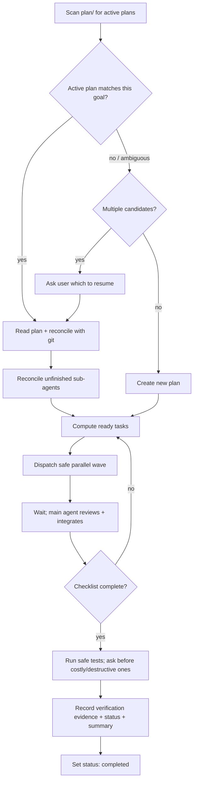

# Task Planning

A durable planning loop for engineering work that spans multiple dependent phases,
survives across sessions, or is explicitly asked to be planned. Every plan lives as
a Markdown file on disk so progress survives interruption, context compaction, and new
sessions. Any agent (you now, you tomorrow, or a teammate) can pick up where the last
one stopped.

The plan file is a **coordination and recovery record**, not the ultimate source of
truth. The real state of the work lives in the repository: `git status`, `git diff`,
the file contents on disk, and test results. On resume you always reconcile the plan
against that reality (see Step 2).

## When to use

Use this skill for tasks that are any of:

- **Multi-phase** with dependencies between phases that must be ordered and tracked.
- **Cross-session** work likely to span multiple sittings or hand off between agents.
- **Substantial** implementation, migration, or refactoring touching many files or systems.
- **Explicitly requested** planning, checkpoints, ownership, or verification evidence.

Do **not** use this skill for:

- Read-only analysis, code review, or investigation with no code changes.
- Quick, localized fixes (a one-line change, a single obvious edit).
- Any situation where the user asked you **not** to create files.

## The loop (do this in order)



### Step 1 — Check for unfinished work first

Before planning anything new, look in the project's `plan/` folder for plans whose
status is still open. Do not rely on the filename alone; open each candidate and read
its YAML frontmatter `status` field (`active`, `paused`, or `blocked` all mean open).

- The plan folder is discovered via git: the script runs `git rev-parse --show-toplevel`
  and uses `<git-root>/plan`. Outside a git repo it will not guess — pass `--dir` explicitly.
- Prefer the automation script: `python -X utf8 scripts/plan.py list` prints every plan
  with its `plan_id`, status, `verification_status`, goal summary, and last-updated time.
- **Match before resuming.** Only resume a plan whose **goal** matches the task the user
  is actually asking for. Compare the plan's `plan_id` and goal summary against the
  current request. An open plan for an unrelated goal must not be silently continued.
- If more than one open plan could match, list them (id + goal) and ask the user which
  to resume. Resume the most recently updated only when the user is absent and the goal
  clearly matches.

### Step 2 — Resume an unfinished plan

When an open plan matches the current goal:

When the user explicitly chooses to continue an interrupted task, first select the
matching plan and reconcile it; do not immediately restart every previously delegated
agent. If the plan is `paused`, set it back to `active` only after this selection. A
`blocked` plan remains blocked until its recorded blocker is actually resolved.

1. **Read the whole plan file** — the diagram (intended design), the checklist (done vs.
   remaining), the Sub-agent Registry (delegated attempts and checkpoints), the change
   log (what was touched and by whom), the blockers, and the bug & fix log.
2. **Reconcile with reality.** The plan is a recovery record, not ground truth. Verify
   against the repo: run `git status` and `git diff`, open the files the log claims were
   changed, and confirm the recorded baseline still holds. Fix the checklist if it drifted
   from what is actually on disk.
3. **Reconcile delegated work before restoring it.** Follow "Resume only unfinished
   sub-agents" below. Do not spawn or resume anything until the task checkbox,
   dependencies, file ownership, repository state, and live agent state agree.
4. **Continue from the first open item**, executing and logging exactly as if you had
   written the plan yourself. Update `updated` in the frontmatter as you go.

#### Resume only unfinished sub-agents

Treat the Task Checklist as the task outcome and the **Sub-agent Registry** as the
attempt/checkpoint record. Only the main agent writes the registry. Before resuming:

1. Run `python -X utf8 scripts/plan.py agents <plan>` to see every delegated attempt and
   any completed output still awaiting integration. Then use `--unfinished` to filter
   recovery candidates whose task is unchecked and agent status is non-terminal.
2. Query the environment's live sub-agent state when tooling is available (for example,
   list the current agents). Reconcile it with each registry row; a persisted `running`
   value may be stale after an interruption.
3. Re-check the task's dependencies, fixed interface, owned files, and current diff.
   If they changed, update the brief/checkpoint before continuing.
4. Take exactly one action per unfinished attempt:
   - **Still running and visible:** do not start a duplicate turn; monitor it and update
     the registry when it reports.
   - **Interrupted/idle and visible:** continue the same agent (for example with a
     follow-up task) using the persisted checkpoint, remaining work, owned files, and
     current interface contract.
   - **Unavailable in the new session:** do not pretend the old agent was restored.
     Spawn a replacement only if delegation is still safe, mark the old attempt
     `superseded`, and add a new registry row with the new agent reference.
   - **Blocked:** resume only after the blocker is resolved; otherwise leave it blocked.
5. Never resume an attempt marked `completed`, `failed`, `cancelled`, or `superseded`,
   and never resume an agent for a checked task. If a completed attempt still has
   `integration=pending`, the main agent reviews/integrates its result instead.

If the sub-agent tooling is unavailable, preserve the registry entry and continue the
unchecked task in the main agent only after changing ownership in the checklist and
recording why. This prevents duplicate work from being mistaken for recovery.

### Step 3 — Create a new plan when none matches

If no open plan matches, create one. The automation script renders
`assets/plan-template.md` into a real plan: it strips the template-only prose, fills in
the `{Title}`, and stamps the metadata (timestamps, git branch, and base SHA):

```
python -X utf8 scripts/plan.py init --title user-auth-refactor --goal "..."
```

`init` writes into `<git-root>/plan/` by default. Outside a git repo it will not guess —
pass `--dir <path/to/plan>` explicitly.

**Filenames are stable; status is not.** The filename encodes only a sortable
second-level timestamp and a title slug, never the mutable status:

```
YYYYMMDD-HHMMSS-<title-slug>-Plan.md
```

Full example: `plan/20260715-143005-user-auth-refactor-Plan.md`. The second-level
timestamp (plus a random suffix on the rare collision) keeps `plan_id`s from clashing;
existing files are never silently overwritten.

Mutable state lives in the YAML frontmatter, not the filename, so the file never has to
be renamed as work progresses:

```yaml
---
plan_id: 20260715-143005-user-auth-refactor
title: User Auth Refactor
goal: "One sentence describing what done looks like."
status: active               # active | paused | blocked | completed | cancelled | superseded
verification_status: not-run # verified | partial | not-run
owner: main-agent
repo_root: /abs/path/to/repo
branch: feature/auth-refactor
base_sha: a1b2c3d
created: 2026-07-15 14:30
updated: 2026-07-15 14:30
---
```

A new plan must contain the sections defined in `assets/plan-template.md`, in order:
header metadata, scope & non-goals, acceptance criteria, assumptions & constraints,
baseline tests, the design diagram, the task checklist (with dependencies, exact write
scopes, and waves), the Sub-agent Registry, risks & rollback, blockers, change log,
verification evidence, bug & fix log, completion summary, and an explicit **Next Steps**
line.

Validate a plan at any time with `python -X utf8 scripts/plan.py check <file>`; add
`--strict` for the full contract check (populated metadata, no leftover placeholders,
unique task IDs, every dependency defined, and no dependency cycles).

### Step 4 — Pick the right diagram for the task

Design the flow **before** writing code; this is where you catch ordering and interface
problems early. Choose the Mermaid diagram type that actually fits the task instead of
forcing a sequence diagram:

- **`sequenceDiagram`** — request/response flows and call chains across components.
- **`flowchart`** — branching logic, pipelines, decision trees, build/deploy flows.
- **`stateDiagram-v2`** — lifecycle or state-machine work.
- **dependency graph (`flowchart`)** — dependency upgrades, migrations, task ordering.

If the task is a documentation change, a data migration, or otherwise has no meaningful
control flow, a diagram may add no value — omit it and say so in the plan. Keep whatever
diagram you include honest: if the real design drifts during implementation, update it.

### Step 5 — Split the checklist and run safe work in parallel

Separate the checklist by dependency, then prefer **parallel waves** for every set of
ready tasks. Keep dependent work in the main thread until its prerequisite contract is
stable; dispatch unrelated file-owned work together instead of waiting for it serially.

Treat a task as parallel-ready only when all of these conditions hold:

1. The host exposes sub-agent operations and permits the required writes.
2. All dependencies are complete, and the task's inputs, outputs, types, signatures, and
   acceptance checks are frozen in the brief.
3. The task has an exact owned-file list; no path, generated output, database, or mutable
   shared state overlaps another in-flight task.
4. The task is self-contained and can report a checkpoint without editing the plan.

If a condition fails, keep that task with the main agent or make the missing contract or
ownership boundary explicit first. Tests and docs are usually dependent on final
interfaces; do not call them independent merely because they touch different paths.
Tag every checklist item `[main]` or `[sub-agent]` and list its dependencies.

#### Parallel wave protocol

Use `python -X utf8 <skill-dir>/scripts/plan.py ready <plan>` to compute unchecked tasks
whose dependencies are complete and which have no unresolved delegated attempt. Treat
that output as candidates, then apply the ownership and wave gates below.

For two or more ready tasks, follow this protocol as one atomic coordination cycle:

1. **Freeze the wave.** Record each task ID, dependencies, exact write scope, fixed
   contract, expected outputs, and targeted verification command. Do not alter these
   boundaries while the wave is running.
2. **Register before spawning.** The main agent adds one Registry row per attempt with
   `status=running`, `integration=pending`, owned files, and the initial checkpoint.
   If spawning fails, immediately record `failed` or `cancelled`. Only the main agent
   edits the Registry.
3. **Launch one batch.** Send each self-contained brief through the host's
   `spawn_agent` equivalent without waiting between calls. If the host lacks a batch API,
   issue the independent calls concurrently. Include exact paths, no-go paths, contract,
   verification command, and the required report fields: status, files changed,
   verification result, remaining work, and next action.
4. **Coordinate by agent reference.** Use `list_agents` (or the host equivalent) to
   reconcile live handles. Use `send_message` for clarifications/checkpoints. Use
   `followup_task` only to continue the same unfinished attempt; never create a duplicate
   for a still-running task.
5. **Wait for the wave barrier.** Use `wait_agent`/`wait_threads` or the host equivalent
   for every member. Do not integrate a partial wave while another member is running,
   unless a dependency exception is written in the plan. A failed or blocked member is
   still resolved at the barrier by recording its state and recovery action.
6. **Review, reject, continue, or integrate.** After the barrier, the main agent inspects
   every diff and report against the frozen contract and owned paths, then runs the
   targeted checks. Update Registry `Status` and `Integration` separately: integrate as
   `completed`/`integrated`; reject unusable output as `completed`/`rejected` (or
   `failed`/`rejected`); or continue the same unfinished attempt with `followup_task` and
   keep integration `pending`. Fold only accepted changes into the checklist and Change
   Log. Leave rejected or unfinished tasks unchecked and record their next action.
7. **Start the next wave.** Recompute ready tasks only after the current wave is resolved.
   Continue until the checklist is complete; the main agent remains responsible for the
   final acceptance pass and integration.

For a single ready task, use the same register-before-spawn and review sequence. If the
host has no sub-agent operations, preserve the task brief and Registry evidence, change
ownership to `[main]`, and execute it serially.

### Step 6 — Log every change as you go

After completing **each** file or task, append a row to the change log — including
sub-agent work (fold their reported rows into the same table after reviewing the diff).
A row records: timestamp, the file or task, what changed, and who did it (`main` or a
sub-agent id). Update the checkbox in the checklist in the same edit. Write these logs as
you finish each unit, never in a batch at the end — an interruption mid-batch loses the
record.

For delegated work, also update the Sub-agent Registry whenever an attempt starts,
checkpoints, blocks, completes, fails, is cancelled, or is superseded. Before an explicit
pause, ask running sub-agents for a compact checkpoint when possible, then record their
remaining work and next action. Sub-agents report checkpoints to the main agent; they do
not edit the shared plan concurrently.

### Step 7 — Testing during the task: decide by cost and side-effect

Do not blanket-ban testing — that would block TDD and timely regression checks. Instead,
gate each check by its **cost and side-effects**, not by whether it is nominally a "test":

- **Run automatically (safe, local, fast):** unit tests for the file you just changed,
  targeted/single-test runs, type-checks, linters, quick compiles. These give fast
  feedback and catch regressions early. (Note that even build/lint can be slow or can
  write generated files — judge the individual command, not its category.)
- **Ask first (costly or side-effecting):** slow or whole-suite runs, anything that
  costs money, hits external/network services, needs credentials, mutates a database, or
  is otherwise destructive. Confirm with the user before running these.

Record a **baseline** at plan start so later failures can be attributed correctly:
capture the known-good state from existing CI or a prior run. If establishing a baseline
would require a costly/side-effecting run, ask first; if the user declines, record
`baseline: not run (deferred by user)` and set `verification_status: not-run`.

### Step 8 — Verify, summarize, and close out

When every checklist item is checked:

1. **Run the acceptance checks per the Step 7 policy.** Safe local checks run
   automatically; costly/side-effecting ones are run only after the user confirms.
2. **Record verification evidence.** In the Verification Evidence section, write the exact
   commands run, their results, and the relevant `git diff` summary. Distinguish
   **new regressions** (must fix) from **pre-existing failures** present in the baseline.
   A pre-existing failure that is out of scope is logged as a **residual risk or blocker**,
   not silently fixed and not a reason to expand scope.
3. **Set `verification_status`** in the frontmatter to reflect how thoroughly the work was
   checked — this is separate from `status` so "done" never overstates "verified":
   - `verified` — acceptance checks ran and pass (regressions triaged).
   - `partial` — some checks ran; others deferred (say which, and why, in the summary).
   - `not-run` — verification was deferred entirely (record the reason and residual risk).
4. **Write the completion summary** — what was built, key decisions, what was verified
   (and how), and anything deferred. If `verification_status` is `partial` or `not-run`,
   the reason and residual risk are **required** here.
5. **Set status to `completed`** (`python -X utf8 scripts/plan.py close --id {plan_id}`
   runs strict validation first, then stamps `updated`/`closed`). The filename does not
   change. `close` refuses a plan that fails strict validation unless you pass `--force`.

## Handling bugs reported after completion

When the user reports a bug on already-completed work and asks you to fix it:

1. Reproduce and fix the bug.
2. **Write it into the relevant plan file's Bug & Fix Log** — symptom, root cause, the
   fix, and the guard that prevents recurrence (a test, an assertion, a validation, or a
   note on the faulty logic to avoid next time). This turns each bug into durable
   knowledge so the same mistake is not repeated in a future session.
3. If the completed plan was closed, reopen it (`status: active`) while fixing, log the
   fix, then close it again — or, if the fix is large, create a new linked plan and
   reference the original `plan_id`.

## Rules that keep plans trustworthy

- **The plan coordinates; the repo is ground truth.** Reconcile against `git status`,
  `git diff`, file contents, and test results — do not trust the checklist blindly.
- **Write early, write often.** Anything not written to the plan is lost on interruption.
- **Never fake a green checkmark.** Only check an item after the change is actually on
  disk and, where relevant, verified.
- **Test by cost, not by blanket rule.** Safe, fast, local checks run automatically;
  slow/paid/external/destructive ones need confirmation first (Step 7).
- **`status` and `verification_status` are separate.** "Completed" describes the work;
  "verified/partial/not-run" describes how thoroughly it was checked. Never let one imply
  the other.
- **One goal per plan file.** If scope balloons into multiple independent deliverables,
  create separate plan files rather than one sprawling one.
- **Recover work, not terminal agents.** Resume only unchecked delegated tasks whose
  registry attempts are running/interrupted (or blocked after resolution). Completed,
  failed, cancelled, and superseded attempts are never automatically restarted.
- **Confirm before destructive steps.** Deleting files, dropping data, or touching
  production still requires the usual caution regardless of what the plan says.
- **Cross-platform commands.** Prefer `python -X utf8` for scripts and keep commands in
  ASCII so curly quotes or long dashes copied into a plan do not break on Windows
  (default GBK) shells.

## Script commands

`scripts/plan.py` is stdlib-only and forces UTF-8. Run it with `python -X utf8`. The
template/asset paths resolve relative to the script (the skill); the plan output folder
resolves relative to the target repo's git root, or an explicit `--dir`.
Resolve the script itself relative to this `SKILL.md`; do not assume the target project
contains its own `scripts/plan.py`.

| Command | What it does |
| --- | --- |
| `init --title <slug> [--goal ...] [--dir ...]` | Create a new plan: git-aware metadata, rendered title, `status=active`, `verification_status=not-run`. Second-level timestamp; random suffix on collision (never overwrites). |
| `list [--dir ...]` | Table of every plan: status, verification, updated, `plan_id`, goal. |
| `check <file> [--strict]` | Validate. `--strict` checks required sections, non-empty required fields, unresolved placeholders, unique task IDs, undefined deps, and dependency cycles. |
| `ready <file>` or `ready --id <plan_id>` | List unchecked tasks whose dependencies are complete and which have no running, interrupted, blocked, or completed-pending-integration attempt. The main agent still applies Write Scope and Wave gates. |
| `agents <file> [--unfinished]` | Show Sub-agent Registry attempts. `--unfinished` excludes checked tasks and terminal attempts; blocked attempts remain visible but are not auto-resumed. |
| `close <file>` or `close --id <plan_id>` | Run strict validation, then set `status=completed` with an atomic write. `--force` closes despite problems. |
| `status <file|--id ...> [--set <status>]` | Print a plan's status, or set it. |
| `pause` / `resume` / `block` / `cancel` / `supersede` | Status transitions. `pause`/`block`/`cancel` require `--reason`; `supersede` requires `--by <plan_id>`. |

## Files in this skill

- `SKILL.md` — this file: the workflow and rules.
- `assets/plan-template.md` — the blank skeleton `init` copies for every new plan.
- `references/20260715-1430-user-auth-refactor-Plan.md` — a filled-in mid-flight example:
  metadata, the dependency-aware checklist split, change-log rows, and a bug & fix entry.
- `scripts/plan.py` — cross-platform helper (`init`, `list`, `check`, `ready`, `agents`,
  `close`, `status`, `pause`, `resume`, `block`, `cancel`, `supersede`).
- `agents/openai.yaml` — OpenAI-format UI metadata (`interface` block).
