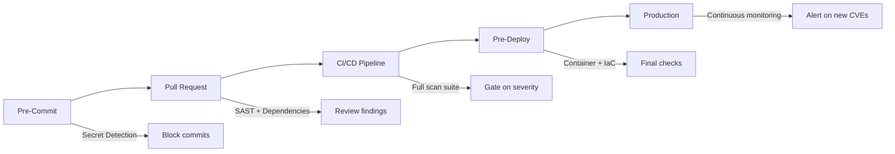

# Security Scanning Suite

## Purpose

"With no vulnerabilities, no security issues" (user's production requirement). This Skill provides comprehensive security scanning and analysis across multiple layers of your application stack.

## Quick Start

Run a complete security scan on your project:

```bash
# Install essential scanners
pip install semgrep detect-secrets pip-audit
npm install -g snyk

# Quick security audit
semgrep --config=auto .                    # SAST scan
detect-secrets scan . > .secrets.baseline  # Secret detection
npm audit --audit-level=moderate          # Dependency scan (Node.js)
trivy fs .                                 # Filesystem vulnerability scan
```

For a production-ready security pipeline, see [PATTERNS.md](PATTERNS.md#pattern-2-cicd-security-pipeline).

## Core Scanning Types

### 1. SAST (Static Application Security Testing)
Code analysis to find security vulnerabilities without running the code.

**Key Tools**: Semgrep, Bandit (Python), ESLint-plugin-security (JS), gosec (Go)

**Detects**: SQL injection, XSS, hardcoded secrets, insecure deserialization

**Quick Check**:
```bash
# Run OWASP Top 10 checks
semgrep --config=p/owasp-top-ten .
```

See [PATTERNS.md](PATTERNS.md#pattern-4-sast-with-semgrep) for custom rule creation.

### 2. Dependency Scanning (SCA)
Find known vulnerabilities in third-party libraries and dependencies.

**Key Tools**: npm audit, pip-audit, Snyk, Trivy, Dependabot

**Detects**: CVEs in dependencies, outdated packages, license issues

**Quick Check**:
```bash
# Node.js
npm audit --audit-level=moderate

# Python
pip-audit --requirement requirements.txt

# Multi-ecosystem
trivy fs --scanners vuln .
```

See [PATTERNS.md](PATTERNS.md#pattern-3-comprehensive-dependency-audit) for multi-language scanning.

### 3. Secret Detection
Prevent credentials and API keys from being committed to version control.

**Key Tools**: TruffleHog, detect-secrets, GitLeaks, git-secrets

**Detects**: API keys, passwords, tokens, private keys, connection strings

**Quick Check**:
```bash
# Scan current directory
gitleaks detect --source .

# Scan git history
trufflehog git file://. --json
```

See [PATTERNS.md](PATTERNS.md#pattern-1-pre-commit-secret-detection) for pre-commit hooks.

### 4. Container Security
Scan Docker images and containers for vulnerabilities.

**Key Tools**: Trivy, Grype, Docker Scout, Snyk

**Detects**: Base image vulnerabilities, misconfigurations, malware

**Quick Check**:
```bash
# Scan Docker image
trivy image myapp:latest --severity HIGH,CRITICAL

# Scan Dockerfile
trivy config Dockerfile
```

See [PATTERNS.md](PATTERNS.md#pattern-5-container-security-scanning) for comprehensive scanning.

### 5. Infrastructure as Code (IaC) Security
Analyze Terraform, CloudFormation, Kubernetes configs for security issues.

**Key Tools**: Checkov, tfsec, KICS, Terrascan

**Detects**: Misconfigurations, excessive permissions, insecure defaults

**Quick Check**:
```bash
# Scan Terraform
checkov -d infrastructure/ --framework terraform

# Scan Kubernetes
checkov -d k8s/ --framework kubernetes
```

See [PATTERNS.md](PATTERNS.md#pattern-6-iac-security-analysis) for IaC scanning workflows.

### 6. Dynamic Application Security Testing (DAST)
Runtime security testing of running applications.

**Key Tools**: OWASP ZAP, Nuclei, Burp Suite

**Detects**: Authentication issues, injection flaws, misconfigurations

**Quick Check**:
```bash
# Run ZAP against API
docker run -t owasp/zap2docker-stable zap-baseline.py -t http://localhost:8080
```

See [PATTERNS.md](PATTERNS.md#pattern-7-api-security-testing) for API security testing.

## Implementation Workflow



## Common Security Gotchas

### 1. False Positives Overload
SAST tools generate many false positives that can overwhelm teams.

**Solution**: Start with high/critical only, use `# nosec` comments judiciously, create baseline files. See [GOTCHAS.md](GOTCHAS.md#false-positives) for detailed strategies.

### 2. Secrets in Git History
Removing secrets from the current commit isn't enough - they remain in history.

**Solution**: Use `git filter-repo` to rewrite history, immediately rotate all exposed credentials. See [GOTCHAS.md](GOTCHAS.md#secrets-in-history) for cleanup procedures.

### 3. Transitive Dependencies
Your dependencies have dependencies, creating a deep vulnerability tree.

**Solution**: Use lock files, scan with `--include-transitive` flags, automate updates. See [GOTCHAS.md](GOTCHAS.md#transitive-dependencies) for management strategies.

## File Structure

- **[SKILL.md](SKILL.md)** - This file, quick start and overview
- **[KNOWLEDGE.md](KNOWLEDGE.md)** - Security concepts, OWASP Top 10, tool comparisons
- **[PATTERNS.md](PATTERNS.md)** - Implementation patterns for each scan type
- **[EXAMPLES.md](EXAMPLES.md)** - Complete working examples and scripts
- **[GOTCHAS.md](GOTCHAS.md)** - Troubleshooting and common issues
- **[REFERENCE.md](REFERENCE.md)** - Tool APIs and configuration reference

## Related Skills

- `deployment-automation-toolkit` - Integrate security into deployments
- `code-review-framework` - Security-focused code reviews
- `architecture-evaluation-framework` - Security architecture assessment
- `gap-analysis-framework` - Security gap identification

## Quick Reference

| Scan Type | Critical Tool | Command | When to Use |
|-----------|--------------|---------|-------------|
| SAST | Semgrep | `semgrep --config=auto .` | Every commit |
| Secrets | Gitleaks | `gitleaks detect --source .` | Pre-commit |
| Dependencies | npm/pip audit | `npm audit` | Daily |
| Containers | Trivy | `trivy image <name>` | Pre-deploy |
| IaC | Checkov | `checkov -d .` | Infrastructure changes |
| DAST | OWASP ZAP | `zap-baseline.py -t <url>` | Staging/QA |

For detailed implementation, see [PATTERNS.md](PATTERNS.md). For troubleshooting, see [GOTCHAS.md](GOTCHAS.md).
