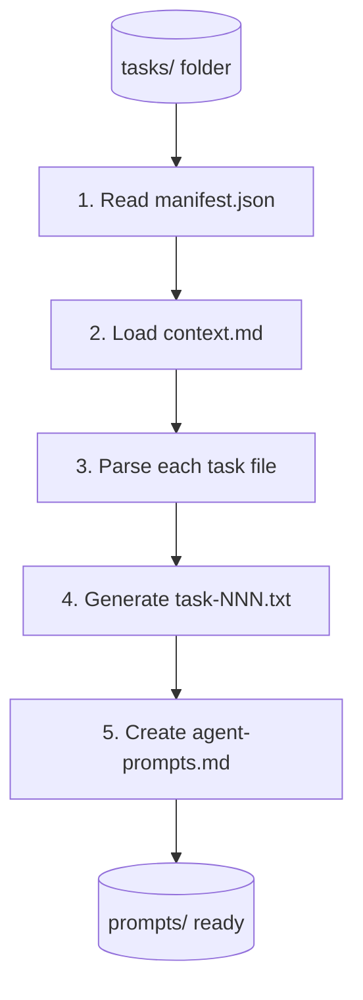

# Prompt Generator

Generate agent-ready prompts from existing task specification files in `tasks/`.

## CRITICAL: Prompt Template Requirements

Every generated prompt file MUST include ALL of these sections (see Step 4 for full template):

| Section | Purpose | Required |
|---------|---------|----------|
| `=== CONTEXT ===` | Shared project context | YES |
| `=== OBJECTIVE ===` | Task goal | YES |
| `=== CONTRACTS ===` | Contract file references | YES |
| `=== FILES TO CREATE ===` | Scope CREATE | YES |
| `=== FILES TO MODIFY ===` | Scope MODIFY | YES |
| `=== DO NOT MODIFY ===` | Scope BOUNDARY | YES |
| `=== IMPLEMENTATION REQUIREMENTS ===` | Requirements | YES |
| `=== ACCEPTANCE CRITERIA ===` | Checklist | YES |
| `=== EXECUTION INSTRUCTIONS ===` | How to implement | **MANDATORY** |
| `=== IMPORTANT RULES ===` | Constraints | **MANDATORY** |
| `=== OUTPUT FORMAT (REQUIRED) ===` | JSON output block | **MANDATORY** |
| `=== COMPLETION SIGNAL ===` | touch .claude-task-complete | **MANDATORY** |

**DO NOT generate prompts without the EXECUTION INSTRUCTIONS, IMPORTANT RULES, OUTPUT FORMAT, and COMPLETION SIGNAL sections.**

## When to Use

- After editing task files in `tasks/`
- To regenerate prompts with updated template
- Before running `cpo run` if prompts are missing
- To test different prompt formats

## Input Requirements

The parallel directory must have:
```
parallel/TS-XXXX-slug/
  manifest.json       # Required: wave structure, agents
  context.md          # Required: shared context
  contracts/          # Required: types.py, api-schema.yaml
  tasks/              # Required: task-*.md files
    task-001-users.md
    task-002-products.md
```

## Output

Generates:
```
parallel/TS-XXXX-slug/
  prompts/
    agent-prompts.md   # Wave summary and launch commands
    task-001.txt       # Individual agent prompt
    task-002.txt
    ...
```

## Workflow



## Step 1: Read manifest.json

Extract:
- Wave structure and task ordering
- Agent assignments per task
- Tech spec reference
- Technology stack

## Step 2: Load context.md

The shared context is injected into every prompt for efficiency.

## Step 3: Parse Task Files

For each `tasks/task-NNN-*.md`:

1. **Extract YAML frontmatter**:
   ```yaml
   id: task-001
   component: users
   wave: 1
   deps: []
   agent: python-experts:django-expert
   contracts: [contracts/types.py, contracts/api-schema.yaml]
   ```

2. **Extract Markdown sections**:
   - `## Scope` -> CREATE, MODIFY, BOUNDARY
   - `## Requirements` -> Implementation requirements
   - `## Checklist` -> Acceptance criteria

Note: The Output Format section is **not** in task files. It's a **static template** that the prompt generator always includes in generated prompts.

## Step 4: Generate Individual Prompts

Create `prompts/task-NNN.txt` using this template:

```
TASK-{id}: {title}
Agent: {agent}
Wave: {wave}
Dependencies: {deps or "None"}

=== CONTEXT ===
{contents of context.md}

=== OBJECTIVE ===
{First line of task description or component name}

=== CONTRACTS ===
Reference these contract files before implementing:
{list of contract files with full paths}

=== FILES TO CREATE ===
{CREATE section from Scope}

=== FILES TO MODIFY ===
{MODIFY section from Scope}

=== DO NOT MODIFY ===
{BOUNDARY section from Scope}

=== IMPLEMENTATION REQUIREMENTS ===
{Requirements section content}

=== ACCEPTANCE CRITERIA ===
{Checklist section content}

=== EXECUTION INSTRUCTIONS ===

You MUST write code, not just describe it. Follow these steps:

1. **Read contracts first**: Read all files in contracts/ to understand interfaces
2. **Read existing code**: If modifying files, read them first
3. **Implement**: Use Write/Edit tools to create/modify code
4. **Test**: Run tests to verify implementation
5. **Lint**: Run linters (ruff, mypy, eslint as appropriate)
6. **Commit**: Create atomic commit with conventional format

=== IMPORTANT RULES ===

- Do NOT ask for confirmation - proceed immediately with implementation
- Do NOT modify files listed in DO NOT MODIFY section
- Do NOT skip writing tests
- Do NOT deviate from contract interfaces
- STOP if you encounter blocking issues and report in output

=== OUTPUT FORMAT (REQUIRED) ===

You MUST end your response with this JSON summary block:

```json
{
  "task_completed": boolean,
  "validation_passed": boolean,
  "files_created": [string],
  "files_modified": [string],
  "tests_run": integer,
  "tests_passed": integer,
  "tests_failed": integer,
  "summary": string,
  "full_log": string,
  "error_message": string | null
}
```

Set `validation_passed: true` ONLY if ALL acceptance criteria are met.

=== COMPLETION SIGNAL ===

Upon successful completion, run: touch .claude-task-complete
```

## Step 5: Create agent-prompts.md

Summary file with launch commands:

```markdown
# Agent Prompts for {name}

Generated: {timestamp}
Tech Spec: {tech_spec_id}
Total Tasks: {count}

## Wave Execution Order

### Wave 1 (Parallel)
| Task | Agent | Component |
|------|-------|-----------|
| task-001 | python-experts:django-expert | users |
| task-002 | python-experts:django-expert | products |

### Wave 2 (Parallel, depends on Wave 1)
| Task | Agent | Component |
|------|-------|-----------|
| task-003 | python-experts:django-expert | orders |

## Launch Commands

### Using cpo (Recommended)
```bash
cpo run parallel/{slug}/
```

### Manual Execution (Wave 1)
```bash
# Run in parallel terminals or with &
claude --prompt-file prompts/task-001.txt --agent python-experts:django-expert &
claude --prompt-file prompts/task-002.txt --agent python-experts:django-expert &
wait
```

### Manual Execution (Wave 2)
```bash
# After Wave 1 completes
claude --prompt-file prompts/task-003.txt --agent python-experts:django-expert
```

## Prompt Files

| File | Task | Lines |
|------|------|-------|
| prompts/task-001.txt | task-001-users | ~150 |
| prompts/task-002.txt | task-002-products | ~145 |
| prompts/task-003.txt | task-003-orders | ~160 |
```

## Validation Before Generation

Check these conditions:

- [ ] `manifest.json` exists and is valid JSON
- [ ] `context.md` exists
- [ ] `contracts/` directory exists with at least one file
- [ ] `tasks/` directory has at least one task file
- [ ] All tasks referenced in manifest exist in `tasks/`

## Error Handling

### Task Not in Manifest
```
WARNING: task-005-api.md exists but not in manifest.json
  -> Skipping prompt generation (add to manifest first)
```

### Missing Contract Reference
```
WARNING: task-001 references contracts/types.py but file doesn't exist
  -> Generate prompt with warning comment
```

## Regeneration Mode

When prompts already exist:

1. **Backup existing**: Move to `prompts.backup-{timestamp}/`
2. **Generate fresh**: Create new prompts from current tasks
3. **Report diff**: Show what changed

```bash
# Command triggers regeneration
/parallel-generate-prompts parallel/TS-0042-inventory/ --force
```

## Token Optimization

The generated prompts are optimized for token efficiency:

- Context is included once (not repeated per section)
- Contract paths reference files (agent reads them)
- Scope uses compact CREATE/MODIFY/BOUNDARY notation
- Checklist is actionable, not verbose

## Integration with cpo

The `cpo run` command expects:
1. `manifest.json` with wave structure
2. `prompts/task-NNN.txt` for each task in manifest

This skill ensures prompts match what `cpo` expects.

## Post-Generation Validation

After generating prompts, verify EACH prompt file contains:

```bash
# Quick validation - each prompt should have these markers
for f in prompts/task-*.txt; do
  echo "=== $f ==="
  grep -c "=== OUTPUT FORMAT" "$f" || echo "MISSING: OUTPUT FORMAT"
  grep -c "=== EXECUTION INSTRUCTIONS" "$f" || echo "MISSING: EXECUTION INSTRUCTIONS"
  grep -c "=== COMPLETION SIGNAL" "$f" || echo "MISSING: COMPLETION SIGNAL"
  grep -c '"task_completed"' "$f" || echo "MISSING: JSON block"
done
```

**If any prompt is missing these sections, regenerate it using the exact template from Step 4.**

## Related Skills

| Skill | Relationship |
|-------|--------------|
| `parallel-decompose` | Creates tasks/ that this skill reads |
| `parallel-task-format` | Defines the task YAML format parsed here |
| `parallel-execution` | Consumes the prompts/ this skill generates |
| `parallel-agents` | Overall workflow context |
