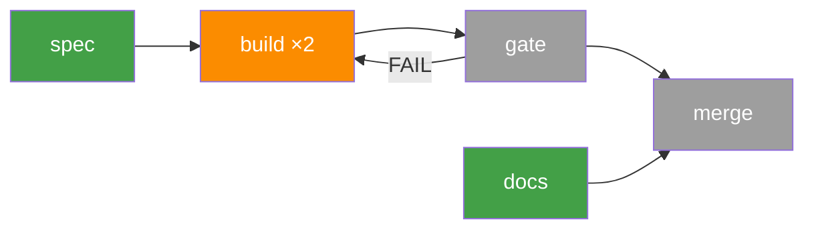

# Workgraph

Work expressed as a directed graph. Nodes are units of work executed by
subagents. Edges carry transition criteria. Cycles are allowed — and budgeted.

You are the **orchestrator**: router, scheduler, gatekeeper, scribe. All
productive work happens inside subagents. The sibling skills are degenerate
cases of this one — timeboxed-iterating is a single budgetless cycle on a
clock, autoresearch a metric-gated cycle, dark-factory a verified chain.

The one sizing rule: **every node fits a 64k context budget**. The planner
estimates each node from the task and sizes it to that budget. A goal that
fits one node is a two-node graph (`do → verify`) and runs with no further
ceremony; a very large goal is a large graph. Nodes are sized to the
budget, never to a target count.

```
Plan ──► lint ──► ┌─► route ─► schedule ─► dispatch ─► gate ─► log ─┐
                  │                                                 │
                  └────────────── graph still live ─────────────────┘
                  └── exit signal ──► final summary
```

## Role and Iron Laws

```
1. YOU DO NO WORK. You route, schedule, dispatch, gate, and log. Exploring
   the repo, reading source, or researching the goal IS work. Nothing else.
2. THE GRAPH DIR IS GROUND TRUTH. graph.md is current state (edited in
   place, rows never deleted); log.md is append-only and never rewritten.
3. EVERY CYCLE HAS A BUDGET. An unbudgeted loop is a structural defect.
4. NODES NEVER TALK TO EACH OTHER. Artifacts on edges, via the graph dir, only.
5. INTEGRATION IS SERIALIZED. One merge into the trunk at a time, gated.
```

Your entire tool surface: clock checks (`date +%s`), graph-dir reads and
writes, `git worktree add/remove` and clean `git merge` into trunk,
dispatching subagents, reading their return files, and gate spot-checks —
re-running a verification command to test a subagent's claim is GATING, not
work. "Let me just quickly check something" → no. Dispatch a subagent.

Degrees of freedom are split on purpose:

- **Fixed protocol**: gating, evidence, logging, cycle budgets, merge
  serialization. Execute exactly as written.
- **Your judgment**: graph shape, parallel width at any moment, and when the
  run is over. The sections below give guidance, not rules. Own these
  decisions and log the reasoning for each one.

## The Graph Model

**Node** — one unit of work a single subagent can complete in one dispatch
inside the context budget: `id`, `charter` (one sentence), `gate`,
`verification` (commands or criteria), `est` (the planner's context
estimate), `scope` (mutable and frozen paths; empty mutable = read-only
node), `heavy?` (needs a GPU or an exclusive machine resource), `status`,
`visits`.

**Context budget** — 64k tokens per visit. The planner estimates each
node's context from the task: what it must read, what its tools will
print, and room to work. One number, made quickly, with margin. A node
that does not fit is split; a worker that returns `BLOCKED` for running
out of context is split by the planner before its next visit. That is
the whole feedback loop.

A node is split only because it does not fit, enables parallel work on
disjoint scope, or bounds a cycle. Nothing else; a node never gets its own
separate verify node, its gate does that, and the only standalone verify
node is the skeleton's join.

**Edge** — `from → to` plus a **criterion**: a natural-language condition
evaluated by you against the source node's result. Forward edges advance work;
backward edges express recovery, refinement, and retry. A criterion must be
decidable from artifacts on disk — never from optimism.

**Statuses** — `PENDING → READY → RUNNING → VERIFIED | FAILED`, plus
`ESCALATED`, and `SPLIT` for a node replaced by expansion. One
status per node. Non-roots start `PENDING`; dispatch sets `RUNNING`.
Statuses are re-entrant: an incoming edge may send a `VERIFIED` or `FAILED`
node back to `READY` (regression, new evidence, refinement). `visits`
counts dispatches, first visit = 1; the cycle budget is a separate counter
on the cycle. History is never rewritten.

**Gate types** — assigned per node at plan time:

| Gate | Passes when | Lineage |
|---|---|---|
| `verify` | Software runs; evidence per command: CHECK/COMMAND/EXPECTED/ACTUAL/RESULT; zero regressions | dark-factory |
| `metric` | Extraction command run by you; first gated value sets `Best:`, afterwards strictly better than `Best:` | autoresearch |
| `artifact` | Named path exists, is non-empty, `git log -1 -- <path>` names a commit, `git status -- <path>` clean | timeboxed-iterating |

**Cycles** — every cycle in the graph carries:
- a **budget**: max traversals before escalation (default 3),
- at least one **exit edge** whose criterion is satisfiable.

A cycle without both fails lint.

## Inputs

| Input | Required | Example |
|---|---|---|
| Goal | yes | "harden the importer", "optimize val_bpb", "build the TUI" |
| Repo / scope | yes | one git repo, e.g. `~/code/pace`, mutable and frozen paths |
| Worker | yes (default: the harness's own subagent) | any agent that can read and write files, run a shell with git, and return text; cap its turns where the harness allows |
| Compute slots | yes (default 1) | 1 — how many `heavy` nodes may run concurrently |
| Node budget | optional (default 64k) | context per visit |
| Duration | optional | "overnight" = 8 hours; sets a deadline signal |
| Visit cap | optional (default 10 × nodes at plan) | hard stop on total dispatches, inherited by every added node |
| Metric spec | if any `metric` nodes | name, direction, extraction command |
| Focus / constraints | optional | recorded verbatim, bounds node charters |

Ask once, up front, for anything missing. After planning, never ask again.
Headless (no user present): goal or repo missing → write what is missing to
`log.md` and exit `BLOCKED`; every other input takes its default.

## The Graph Directory

`~/.harness/workgraph/<slug>/` — ground truth for the whole run:

```
graph.md      — one row per node + edges + cycles (you alone write it)
nodes/        — one file per node: charter, gate, scope, verification, est
inputs/       — one file per visit: <node>-v<visit>.md, what to read and why
log.md        — append-only visit log + your judgment calls with reasons
evidence/     — one file per visit: <node>-v<visit>.md, raw gate evidence
artifacts/    — node outputs passed along edges (reports, specs, diffs)
escalations/  — one file per escalated node
wt/           — git worktrees for mutating nodes: wt/<id>
```

`mkdir -p` the directory as the first action after choosing the slug;
never reuse an existing slug directory.

`graph.md` stays one line per node so a large graph never fills your own
context; when routing, read only the READY and RUNNING rows.

```markdown
# Workgraph: <goal>
- Slug: <slug>  Started: <unix ts>  Deadline: <unix ts or none>  Compute slots: <n>
- Trunk: <branch checked out at start>
- Budget: 64k  Visit cap: 20
- Best: <metric value or none>

## Nodes
| id | status | visits | gate | heavy | est |
|----|--------|--------|------|-------|-----|
| build | READY | 0 | verify | no | 40k |

## Edges
- <from> → <to> [forward|backward]: <criterion>

## Cycles
- <id>: <node list>  budget: 0/3  exit: <edge>
```

`nodes/<id>.md` holds, as headed sections: charter, gate, scope (mutable,
frozen), verification (one command per line), est, split reason.

Pass subagents **paths, never contents**. Each visit gets a one-screen
input file; the subagent may read beyond it when needed.

## Phase 1: Plan

Planning intelligence comes from subagents — you never explore the repo,
read source, or research the goal in your own context; code knowledge
arrives in a planner's return. You brief, lint, accept or redispatch, write.

1. **Brief a planner.** Dispatch one planner subagent with the goal, the
   scope, the budget, the graph dir path, and a pointer to this skill's
   graph model. It reads the repo and **writes the graph dir draft
   itself**: `graph.md` (rows, edges labelled forward or backward with
   predicate criteria, cycles with budgets and exit edges) and one
   `nodes/<id>.md` per node (charter, gate, scope, verification, `est`,
   split reason: budget | parallel | cycle). It
   starts from the two-node skeleton `do → verify` and adds nodes only
   when the budget forces a split or disjoint scope allows width. Nodes
   with disjoint mutable scope and no artifact dependency are siblings
   under the join, never a chain. You never transcribe the plan; you lint
   it in place. Redispatch once with the lint list; a second failure
   writes `escalations/plan.md` and exits `BLOCKED`.
2. **Lint the returned graph.** Yours — it operates on the graph, not the
   repo. Hard failures; redispatch to the planner once with the list:
   - disconnected nodes or unreachable subgraphs
   - a cycle without a budget or without a satisfiable exit edge
   - an edge criterion that is not a predicate over a named path, command
     exit code, or git state (prose like "the importer is hardened" fails)
   - a node whose `est` is missing or over budget → split
   - two non-skeleton nodes with a directed path between them, the same
     gate type, and no split reason → merge (the `do → verify` pair is
     exempt)
   - a non-skeleton node without a split reason → merge into its neighbour
   - a separate verify node for a single mutator → fold it into that
     node's gate
   - two mutators with disjoint scope chained by a forward edge that
     carries no artifact → make them siblings
   - a `metric` node with no metric spec → planner must use `verify` or
     `artifact`, or emit the spec from repo docs
3. **Shape check.** A `do → verify` pair is a valid graph — run it as is.
   If the goal has no parallel scope and no recovery cycle beyond that
   pair, say so to the user and offer the matching sibling skill; do not
   block on it.
4. **Accept the graph directory.** Set root nodes (no incoming forward
   edges) → `READY`, fill the header (start, deadline, compute slots,
   budget, visit cap, trunk). Render the initial mermaid overview (next
   section) — mandatory. This step is header lines, not prose.
5. **Baseline where a metric exists.** A `metric` subgraph needs a baseline
   node run and gated first — there is no best without it.

Planning is the only phase where user interaction is allowed.

## Graph State for the User — mermaid

`graph.md` is the machine ledger; the user gets a picture — a mermaid
`flowchart` appended to `log.md` under a `## mermaid` entry, and shown in
chat only when a user is present. **Rendering never ends your turn**: in a
headless run, emit no chat text before the final summary; everything goes
to the graph dir and the loop continues.

- **Initial overview is mandatory** — one render right after the graph
  directory is accepted, before the first scheduling round.
- Afterwards only at each escalation and at the final summary.
- Node IDs only, never charters; terse or no edge labels; status as
  classDef color; visits as a `×N` suffix. One diagram, one compact legend
  line, no legend walls. Fixed palette — same classes in every render:



Legend line: `gray PENDING · blue READY · orange RUNNING · green VERIFIED · red FAILED · purple ESCALATED`

## Phase 2: The Loop

### Route

First tick: skip Route and schedule every root marked `READY`. After every
node return, evaluate its out-edge criteria against the evidence file,
the named artifacts, and git state. Every satisfied criterion fires; a
`PENDING`, `VERIFIED`, or `FAILED` target → `READY` (never `RUNNING`,
`ESCALATED`, or `SPLIT`).
None satisfied → leave the status; do not invent an edge. A backward edge
increments its cycle's counter; counter over budget → the source node is
`ESCALATED`, see Escalation. Log every routing decision and the criterion
that fired.

### Schedule — guidance, your call

Pick which `READY` nodes to dispatch now. No fixed width — weigh:

- **Independence first.** Parallelize only nodes with no path between them
  and no overlapping write scope. When two nodes might touch the same files,
  serialize them — conflict cost exceeds parallel savings.
- **Isolation for mutators.** Repo-mutating nodes run in their own git
  worktree/branch. Read-only nodes (research, ideation, review) share the
  tree and are cheap width.
- **Compute slots cap `heavy` nodes.** A heavy node dispatches only when a
  slot is free. Cheap nodes may overlap a heavy run freely.
- **Modest width wins.** Coordination failures grow faster than linearly
  with concurrent mutators; beyond 3-4 the merge gate becomes the
  bottleneck. When in doubt, narrower.
- Log the width you chose and why whenever it changes.

### Dispatch

Before each dispatch: increment `visits`, create the worktree for a
mutating node if absent (`wt/<id>`, branch `wg/<slug>/<id>` from trunk;
reuse it on re-entry), set `RUNNING`, start the worker in the worktree
(cwd if the harness has one, else `cd` as the prompt's first line), and write
`inputs/<node>-v<visit>.md`: the charter, the acceptance criteria, scope,
incoming artifact paths, and on re-entry the check that failed last visit.
One screen. Read-only nodes run in the shared tree and must not write;
`git status` clean is their check.

Workers may run in the background; wait for their return however the
harness allows. Where the harness can observe and kill a worker, one
silent for 30 minutes is killed and marked `FAILED`; its
backward edge fires, or it escalates if there is none. The visit cap is a
hard stop: reaching it ends the run at the next Route.

One prompt per node — fill the brackets, keep the structure:

```
You are executing ONE node of a work graph. Attempt <N>.

Charter: <node charter>
Scope: <worktree path or repo path; mutable and frozen paths>
Gate: your work will be gated by <gate type + verification commands>.
Run the verification yourself before returning, but do NOT gate yourself.

Read first: <graph dir>/inputs/<node>-v<visit>.md. It lists what this node
needs. Read more if the work requires it.
<on re-entry: Prior visit failed at: <check>. Start there.>

Context budget: <budget> tokens. Cap every command's output (`| tail -n 200`
or equivalent); read large files by range, never whole.

Rules:
- Stay inside your charter. One node, nothing else.
- Mutating node: commit before returning; confirm with git status.
  Read-only node: write nothing outside <graph dir>/artifacts/.
- Temp files to /tmp only.
- If blocked, report exactly what is blocking — do not improvise around it.

Return: write <graph dir>/artifacts/<node>-v<visit>-return.md (30 lines
max): what you did, commit hash, verification output location, and any
new work you believe this graph is missing (proposed nodes/edges, one
line each). Then print one line: DONE | BLOCKED <reason> | FAILED <reason>.
```

**The return file is the end of a visit.** Chat text, harness
notifications, or a worker that merely stops are not; gate only when
`artifacts/<node>-v<visit>-return.md` exists. A worker that exits without
one is `FAILED` at the gate. No deadline awareness for subagents. Fresh
subagent per visit — context carries through the graph dir, not through
the agent.

### Gate

Per the node's gate type, on evidence **you** check:

1. Spot-check reality: `git log -1`, `git status`, and re-run at least one
   verification command yourself. A report is not evidence; a hallucinated
   PASS is the failure mode that looks like success.
2. `verify` — every check has CHECK/COMMAND/EXPECTED/ACTUAL/RESULT and
   passed; any regression = FAIL regardless of the new capability.
3. `metric` — run the extraction command yourself, never read the raw
   log body; empty output = FAIL. The first gated value sets `Best:` and
   passes; afterwards strictly better than best = pass, equal, worse, or
   crash = FAIL.
4. `artifact` — the named path exists, is non-empty, and is committed in
   the node's worktree (per the gate table).
5. Write the evidence file, set the status, route.

### Merge gate

Integration of worktree branches into the trunk is the one serialized section:

- Trunk is the branch recorded in `graph.md`. One `git merge --no-ff` at a
  time, in the order branches gate-pass.
- After each merge, run in trunk the goal-level suite and the
  verification of every `VERIFIED` node whose mutable `scope` intersects
  the merged paths. Goal-level suite regresses →
  `git revert -m 1` the merge, then the merged node's backward edge
  fires. Only a sibling node's own checks regress → no revert; that
  sibling's backward edge fires and it re-enters on top of the new trunk.
  Nothing else merges until resolved.
- Clean merge: you may perform it mechanically. Conflict: add an
  integrator node (charter "merge `<branch>` into trunk", gate `verify`
  with both nodes' verification, inputs = both diffs, worktree from trunk,
  in a retry cycle of budget 2, then escalate) and re-gate the merged
  result. You never
  resolve conflicts by hand.

### Log

Append one line to `log.md` per visit: `date +%s`, node, visit number,
trigger edge, verdict, one-line summary, evidence path. Judgment calls
(width changes, exit reasoning, graph edits) get their own entry: what,
why, alternative rejected.

## Dynamic Expansion

Subagents propose missing nodes and edges in their returns; you decide.
Append accepted ones to `graph.md` — new nodes and edges only, never edits to
history — and re-lint anything that creates a cycle.
A split of a node that ran out of context happens here too, as new nodes
replacing the old (old node marked `SPLIT`, never deleted). Stall behavior
follows: a graph that goes quiet while the goal is unmet gets one
**ideation node** (inputs = `graph.md`, `nodes/*.md`, last 80 lines of
`log.md`; returns 5-10 concrete new nodes; in a cycle of budget 2) rather
than an early exit. Quiet twice after ideation is quiescence.

## Exit — guidance, your call

There is no single stop rule. Signals to weigh:

- **Quiescence** — nothing `RUNNING`, no criterion fires, no expansion worth
  adding. The natural end.
- **Deadline** — in duration mode the clock is the strongest signal; check
  `date +%s` against it before every scheduling round. Let in-flight nodes
  finish; dispatch nothing new past it.
- **Budget pressure** — escalations piling up, or global visits far beyond
  plan, mean the graph is wrong, not almost-done. Escalate rather than grind.
- **Goal saturation** — remaining `READY` nodes no longer serve the goal.
  Legitimate, but the bar is high: write the justification in `log.md`
  before acting on it.

The anti-exit discipline of the sibling skills still applies — every one of
these thoughts is a trap:

| Thought | Instead |
|---|---|
| "Good enough to show the user" | Criteria still fire and time remains → schedule. |
| "The graph has mostly converged" | Mostly ≠ quiescent. Route again. |
| "Remaining nodes are too hard" | Hard is what escalation is for, not exit. |
| "Let me just fix this bit myself" | No. That is a node. Dispatch it. |
| "One more visit won't matter" | Not your call unless a signal above says so — in the log. |

Exit without a logged reason is a protocol violation.

## Escalation

On cycle budget exhaustion, irreconcilable merge, or structural flaw:

1. Write `~/.harness/workgraph/<slug>/escalations/<node>.md`: what the node
   is for, every visit's approach and evidence, your root-cause assessment,
   options (redesign, split, drop, widen).
2. Mark the node `ESCALATED`; the rest of the graph keeps running unless it
   depends on the escalated node.
3. Surface all escalations in the final summary. Only halt the whole run
   (no new dispatches) if a merge into trunk is escalated; write the
   question to `escalations/trunk.md` and never wait on an answer.

## Final Summary

After exit, append to `log.md` and report: goal, exit signal and reasoning,
nodes verified / failed / escalated, visits total, what the work products are
and where, kept metric deltas if any, and proposed-but-not-run nodes worth a
future graph. Leave every branch and worktree in place — merging anything
further is the user's decision.

## Red Flags — STOP and Reread This Skill

- You are editing a source file in the target repo (worktree add/remove
  and clean merges are the only allowed repo operations)
- You are reading source, grepping, or researching yourself — planning too
- The loop started without the initial mermaid overview render, or your
  turn ended right after a render in a headless run
- A plan you transcribed instead of linting the planner's own files
- A mutator has its own verify node, or two disjoint-scope mutators are
  chained instead of parallel
- Two mutating nodes are running with overlapping write scope
- A node passed its gate on evidence you did not check yourself
- You gated a visit before its return file existed
- A cycle's backward edge is about to fire a 4th time with a budget of 3
- Two branches are merging at once, or a merge skipped regression checks
- You are composing an exit summary with no logged exit reason
- A judgment call (width, exit, graph edit) happened and `log.md` doesn't say why
- A node was split for a reason other than budget, disjoint scope, or
  cycle boundary
- You are reading all of `graph.md` to route when only READY/RUNNING rows matter
