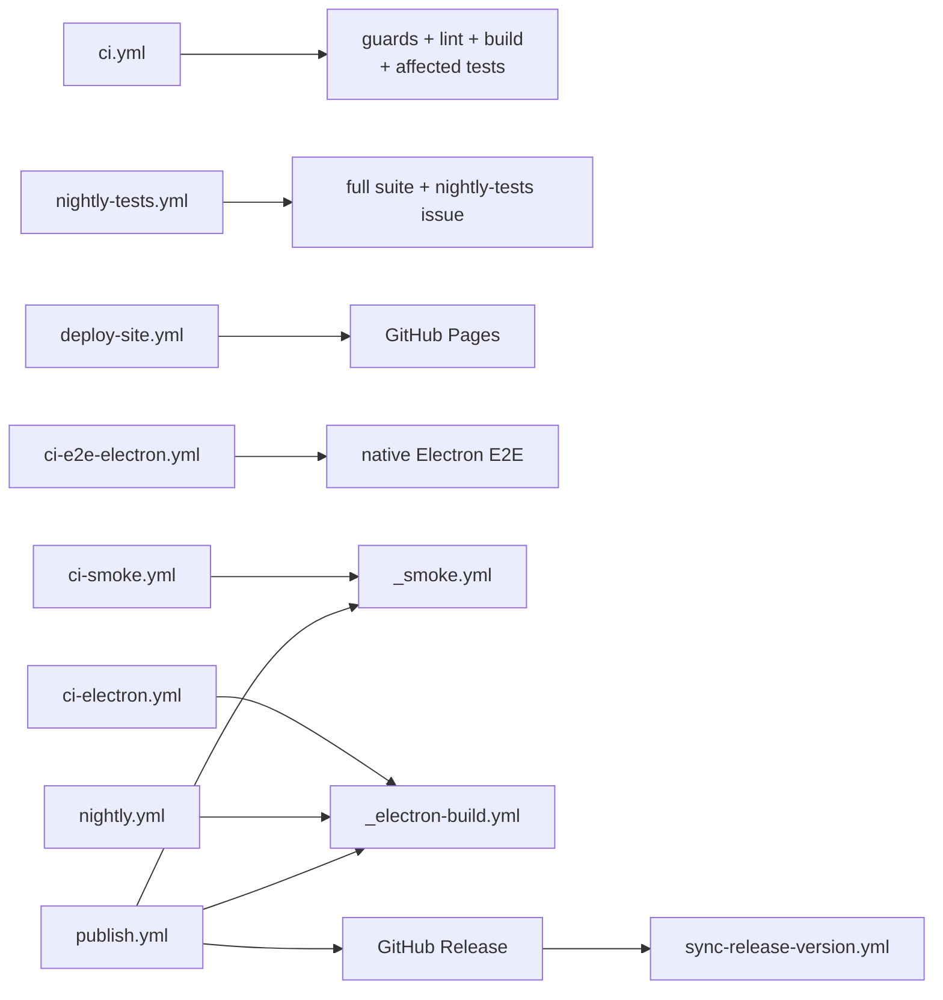
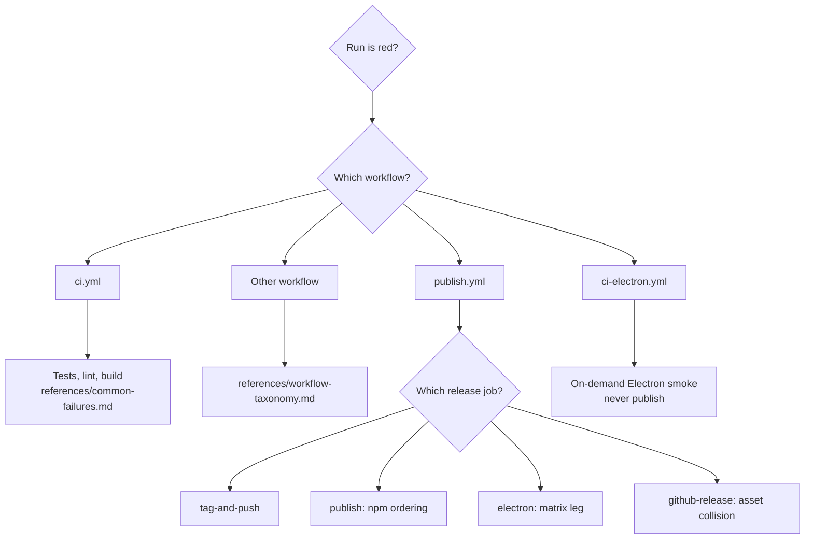
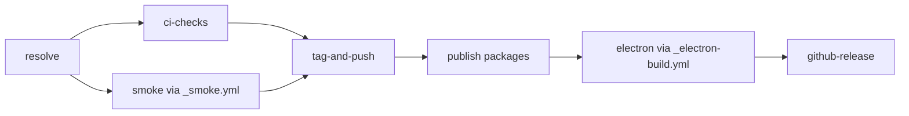

# CI Troubleshoot

Diagnose CI failures for pi-agent-dashboard. The repo has 11 workflow files: 9 entry workflows and 2 reusable workflows.



Full per-workflow detail: [`references/workflow-taxonomy.md`](references/workflow-taxonomy.md).

## First moves — always run these

```bash
pnpm exec tsx .pi/skills/ci-troubleshoot/scripts/list-recent-runs.ts                  # last 10 runs across all workflows
pnpm exec tsx .pi/skills/ci-troubleshoot/scripts/list-recent-runs.ts --failed         # only failed
pnpm exec tsx .pi/skills/ci-troubleshoot/scripts/show-failed-run.ts <run-id>          # failed steps + log tails
pnpm exec tsx .pi/skills/ci-troubleshoot/scripts/show-failed-run.ts                   # most recent failed run
```

These wrap `gh run list`, `gh run view --log-failed`, and similar. You need `gh auth status` to be authenticated.

## `ci.yml` job taxonomy — affected-only tests

`ci.yml` runs parallel jobs (change: speed-up-ci-affected-tests):

| Job | Does | Red means |
|-----|------|-----------|
| `select` | `scripts/select-affected-tests.mjs` → artifact `test-selection` + job summary | selector could not run at all (it degrades to `mode: full` on its own errors) |
| `ci` | guards, spec validate, lint, `lint:e2e`, Biome, build, publish-import checks — NO tests | a guard/lint/build failure |
| `unit` ×4 | the selector's shard `n` via `pnpm run test:parallel <files>` | a test failed, `dist/index.html` missing, or `verify-executed` found an assigned file that never ran |
| `real-process` | real-process files (runs only when selected) | as today's phase 2; retries once under CI |
| `ci-scenarios` | the `RUN_CI_SCENARIOS`-gated packaging files only (skipped for OpenSpec-only diffs) | a packaging scenario failed |
| `ci-result` | aggregate; `check-result.mjs` | `select` failed, a job failed/cancelled, or an EXPECTED job was skipped |

**What did this run skip?** Open the `select` job summary, or:

```bash
gh run download <run-id> -n test-selection -D /tmp/sel
jq '{mode, reason, counts, slowTierDeselected, unmapped}' /tmp/sel/selection.json
jq -r '.selected | to_entries[] | "\(.value)\t\(.key)"' /tmp/sel/selection.json | sort | head   # file → layer
jq '.shards | map(length)' /tmp/sel/selection.json
```

Mode `full` has a reason: a global input (lockfile, root `package.json`, any vitest/tsconfig, setupFiles, the selector or its data), an unmapped file outside `packages/`, a `ci:full` label, `workflow_dispatch`, or a selector error (all-zero/non-ancestor/missing base).

**Force a full run.** `ci:full` label on the PR → takes effect on the NEXT push (there is no `labeled` trigger — on purpose). Immediate: `gh workflow run ci.yml --ref <branch>` (dispatch is always full).

**Slow tier.** `scripts/test-selection/slow-tier.json` (only the 504 s mutation harness) is deselected in affected mode unless the file itself changed; it runs nightly, in full mode, and under `ci:full`. Listed under "Slow-tier deselections" in the summary.

**A test is green on PRs but red nightly.** Not automatically a selection miss — flakes and environment changes do this too. The `nightly-tests` issue names the bisect range (`A..B`, since the last green SCHEDULED run). Bisect in that range to the breaking commit, then open that commit's PR run `test-selection` artifact: if the failing file WAS selected (and executed), debug the test itself; only if it was NOT selected did selection miss it — close the gap with a `scripts/test-selection/triggers.json` entry or a layer fix, never just a re-run.

**`nightly-tests` issue triage.** One open issue, label `nightly-tests`, updated each red scheduled night, closed on the first green one. "no report" = a job was cancelled or died (infra), not a pass. "no new commits" = flake or environment. Refreshed shard timings: artifact `test-timings` → copy to `scripts/test-selection/timings.json` by hand.

**Unit-test failure → read the `vitest-report-*` artifact FIRST, not the log.**
Each vitest job uploads its own report on every run (`if: always()`, 14-day retention):
`vitest-report-unit-<n>`, `vitest-report-real-process`, `vitest-report-ci-scenarios`.

```bash
gh run download <run-id> -p 'vitest-report-*' -D /tmp/vr
# failures
jq -r '.testResults[].assertionResults[] | select(.status=="failed") | .fullName' /tmp/vr/*/vitest*.json
# RETRIED PASSES — passed, but a failed attempt's error is still retained
jq -r '.testResults[].assertionResults[] | select(.status=="passed" and (.failureMessages|length)>0) | .fullName' /tmp/vr/*/vitest*.json
```

There is **no `retryCount` field**. Vitest 4.1.11's JSON reporter emits only
`{ancestorTitles, fullName, status, title, duration, failureMessages, meta, tags}`; `retryCount`
lives on the runner API, not the report. The retried-pass signature is therefore
`status == "passed"` **with a non-empty `failureMessages`**. Verified empirically against a
fail-once fixture; re-verify after a vitest major upgrade — if the second query returns nothing on
a run you know flaked, the reporter shape moved.

Retry semantics: ONLY the `server-real-process` project retries, ONLY under `CI`, ONLY once
(`retry: process.env.CI ? 1 : 0`). A green job whose report matches the retried-pass query did NOT
pass cleanly — that test flaked. A test failing twice still reds the job. Locally retry is 0.
The default reporter prints `(retry x1)` only for tests it lists; a retried PASS is invisible
there, which is why the artifact is the first move.
Locally `npm test` = `test:parallel` then `test:real-process`; in CI the real-process phase is its
own `real-process` job running `vitest run --config packages/server/vitest.real-process.config.ts`.

> Scripts are TypeScript and cross-platform. All invocations use `pnpm exec tsx`, which resolves the declared local dependency and fails if dependencies are absent. `gh` CLI is cross-platform.

## Triage decision tree



## Release pipeline — `publish.yml`

The release flow uses a gated 7-job graph:



Tag-push runs skip `tag-and-push`; `publish.if` accepts that skip while still requiring checks and smoke. **Do not remove `needs: [resolve, publish]` from `electron`**. The bundled server installs the just-published packages. Locked by `packages/shared/src/__tests__/publish-workflow-contract.test.ts`.

Full walkthrough with per-job failure modes: [`references/release-pipeline.md`](references/release-pipeline.md).

## Known failure modes

Maintained in [`references/common-failures.md`](references/common-failures.md). Headline catalog:

| Failure | Where | Diagnosis | Fix |
|---------|-------|-----------|-----|
| `verify-lockfile-versions.mjs` fails | `tag-and-push` | Cross-ref specifier in lockfile doesn't match bumped version | Regenerate lockfile + commit; or fix `scripts/sync-versions.js` |
| CHANGELOG already has `## [X.Y.Z]` | `tag-and-push` | You're re-dispatching with a version that was already promoted | Bump to a new version, or revert the CHANGELOG section |
| `npm publish` 403 | `publish` | OIDC trusted publisher not configured for that package | Configure in npm web UI; or temporarily use NPM_TOKEN |
| Electron matrix leg fails | `electron` | Missing prebuild for node-pty/better-sqlite3 on that OS/arch | Check `bundle-server.mjs` GO/NO-GO guard; rebuild prebuilds |
| `shell: bash` on Windows runner | any | Lint test `no-bash-on-windows.test.ts` flags it | Remove `shell: bash` or guard with `if: runner.os != 'Windows'` |
| Electron job missing `needs:` | repo-lint | `publish-workflow-contract.test.ts` failed | Restore `needs: [resolve, publish]` |
| `Cannot find module @blackbelt-technology/...` in electron | `electron` | `publish` job didn't run or failed; bundled server can't resolve from npm | Check `publish` job — re-run only if it failed; never bypass |
| Fastify crashes in bundled server smoke | any using node | Bad Node version pinned in workflow | Bump `node-version:` to ≥ 22.18.0 |
| Loud-but-harmless `EADDRINUSE` in smoke | smoke job | Concurrent server spawns | Usually self-recovering; check next log lines |
| Green run but a timing test flaked | `ci.yml` `real-process` | `server-real-process` retried once | `vitest-report-real-process` artifact → `passed` + non-empty `failureMessages`; root-cause it, do not ignore |
| `verify-executed` fails: assigned file did not execute | `ci.yml` `unit`/`real-process`/`ci-scenarios` | vitest filter/path mismatch, or the file is no longer collected | Check the file still matches its project `include`; re-run `select` locally: `node scripts/select-affected-tests.mjs --base origin/develop --merge-base --out /tmp/s.json` |
| `ci-result` red with every job green | `ci.yml` | a job the selection EXPECTED was skipped, or `select` failed | Read `ci-result` log: it names the job |
| Nightly red, PR was green | `nightly-tests.yml` | flake, environment, or a selection miss | Bisect the issue's range; check the breaking PR's `test-selection` artifact — selected → debug the test; not selected → trigger/layer fix |
| `real-process-project-guard.test.ts` fails | repo-lint | New server test spawns a process but runs in the parallel project | Add it to `packages/server/vitest.real-process-files.ts`, or annotate `// real-process-exempt: <reason>` |
| `electron` + `github-release` SKIPPED despite green `publish` | `electron` | Tag-push path skips `tag-and-push`; a skipped needs-ancestor poisons electron's DEFAULT `if: success()` | Give `electron` explicit `if: ${{ !cancelled() && needs.publish.result == 'success' }}` (mirrors `publish`'s guard). First hit v0.6.1 |
| `✗ koffi prebuild GO/NO-GO failed at ...koffi\build\koffi\win32_x64\koffi.node` | `electron` (both win32 legs) | koffi@3.x ships the prebuild at `@koromix/koffi-win32-x64/win32_x64/koffi.node`; the 2.x `koffi/build/...` path is never created | Update `bundle-server.mjs` guard to check the 3.x @koromix path first, 2.x fallback. First hit v0.6.1 |
| arm64 NSIS smoke: `pi-dashboard.exe not found ... after 150s` | `electron` (win32-arm64) | x64 runner can't execute an arm64 `Setup.exe`/app, so silent install extracts nothing | Guard the NSIS install-smoke step `if: matrix.platform == 'win32' && matrix.arch == 'x64'`. arm64 installer still builds+ships. First hit v0.6.1 |

## Reading gh logs efficiently

```bash
# Last 10 runs (all workflows, this branch)
gh run list -L 10

# Last 5 failed runs across all workflows
gh run list -L 50 | grep -E 'failure|cancelled' | awk 'NR <= 5'

# Get a specific run, only the failed steps
gh run view <run-id> --log-failed

# Watch a running workflow (live tail)
gh run watch <run-id>

# Re-run only the failed jobs (preserves successful ones, saves CI time)
gh run rerun <run-id> --failed

# Re-run from scratch (rare; usually for flakes)
gh run rerun <run-id>

# Cancel a stuck run
gh run cancel <run-id>
```

`gh run view --log-failed` is the highest-leverage one — it pulls only failed-step output, which is what you want 95% of the time.

**Never bypass the release pipeline with a manual `npm publish`.** That loses OIDC trusted publishing, lockfile synchronization, changelog promotion, smoke gates, and Electron dependency ordering.

**Rerun gotcha (tag-push releases):** `gh run rerun <id> --failed` does NOT re-dispatch skipped downstream reusable-workflow jobs (e.g. `electron`) even after `publish` flips green — they stay `skipped`. After a smoke-**gate** flake on a tag-push release, re-push the tag for a clean single-pass run instead: `git push --delete origin vX.Y.Z && git push origin vX.Y.Z`. `publish` is idempotent (skips already-published packages), so re-pushing the tag is safe.

## When the failure is repo-lint

Repo-lint tests fail the `ci` job specifically. They're listed in `debug-dashboard/references/test-failure-triage.md` → "Repo-lint tests". Fix the file that violated the rule. **Don't loosen the lint** — each one exists because of a real regression.

## Related skills

- `release-cut` — trigger a release (cuts the tag that fires `publish.yml`)
- `release-revoke` — rollback / yank a release
- `debug-dashboard` — when the bug only reproduces locally
- `implement` — back to writing the fix
- `code-review` — review the fix before re-pushing
